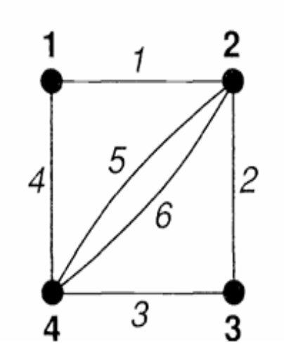
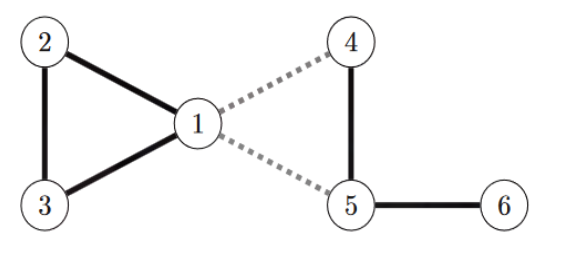

# 图论

## 1.1 定义

### 图的性质

**定义 1（图）** 一个图可以表示为一个二元组 $G = (V, E)$，其中 $V$ 是有限顶点集，$E$ 是有限边集。每条边要么是 $V$ 的一个元素子集，要么是两个元素子集。

**定义 2（自环）** 如果 $G = (V, E)$ 是一个图，$v \in V$ 且 $e = \{v\}$，那么边 $e$ 被称为一个自环。也就是说，任何边是 $V$ 的一个元素子集时，这条边就是一个自环。

我们规定 $E$ 是 $V$ 的一元素或二元素子集的集合，而不是说 $E$ 本身是一个集合。这允许边集中有重复边，从而可以定义多重图。

**定义 3（多重图）** 图 $G = (V, E)$ 是一个多重图，当且仅当在 $E$ 中存在两条边 $e_1$ 和 $e_2$ 使得 $e_1$ 和 $e_2$ 作为集合是相等的。即，存在两个顶点 $v_1$ 和 $v_2$ 使得 $e_1 = e_2 = \{v_1, v_2\}$。

**定义 4（单图）** 图 $G = (V, E)$ 被称为单图，当且仅当它不是一个多重图，且它没有自环。

**定义 5（顶点邻接）** 令 $G = (V, E)$ 为一个图。如果存在一条边 $e \in E$ 使得 $e = \{v_1, v_2\}$，则称顶点 $v_1$ 和 $v_2$ 是邻接的。如果 $e = \{v\}$ 是 $E$ 的一个元素，则称顶点 $v$ 与自身邻接。

**定义 6（边邻接）** 令 $G = (V, E)$ 为一个图。如果存在一个顶点 $v$，使得两条边 $e_1$ 和 $e_2$ 都包含顶点 $v$，则称边 $e_1$ 和 $e_2$ 是邻接的。

**定义 7（邻域）** 令 $G = (V, E)$ 为一个图，$v \in V$。顶点 $v$ 的邻居是与 $v$ 邻接的所有顶点的集合。形式化定义为：
$$
N(v) = \{ u \in V : \exists e \in E \text{，使得 } e = \{v, u\} \text{ 或 } u = v \text{ 且 } e = \{u\} \}
$$

**定义 8（度）** 令 $G = (V, E)$ 为一个图，$v \in V$。顶点 $v$ 的度是与 $v$ 邻接的非自环边的数量，加上自环边数量的两倍。形式化定义为：
$$
\deg(v) = |\{ e \in E : \exists u \in V \text{，使得 } e = \{u, v\} \}| + 2|\{ e \in E : e = \{v\} \}|
$$

**例子** 给定图 $V = \{1, 2, 3, 4\}$ 和 $E = \{\{1, 2\}, \{2, 3\}, \{3, 4\}, \{4, 1\}, \{1\}\}$。构造图并给出每个顶点的度。

**定理 1** 令 $G = (V, E)$ 为一个一般图，则有
$$
2|E| = \sum_{v \in V} \deg(v)
$$

**证明** 考虑 $V$ 中的任意两个顶点 $v_1$ 和 $v_2$。如果 $e = \{v_1, v_2\}$ 是一条边，那么在 $\sum_{v \in V} \deg(v)$ 中，$v_1$ 和 $v_2$ 的度各加了 $+1$。因此，除自环外，每条边正好被计算了两次。而每个自环的度为 $+2$，因此每条边贡献正好 $+2$。证毕。

**定义 9（有向图）** 一个有向图（或称为“有向图”）是一个二元组 $G = (V, E)$，其中 $V$ 是有限顶点集，$E$ 是包含在 $V \times V$ 中的元素集合。也就是说，$E$ 是有序顶点对的集合。$E$ 中的边称为有向边。边 $e = (v_1, v_2)$ 的起点是 $v_1$，终点是 $v_2$。

**注** 值得注意的是，有序对 $(v_1, v_2)$ 与 $(v_2, v_1)$ 是不同的。因此，如果有向图 $G = (V, E)$ 包含边 $(v_1, v_2)$ 和 $(v_2, v_1)$，则它不是一个多重图。

**定义 10（底层图）** 如果 $G = (V, E)$ 是一个有向图，则它的底层图是将每条有向边 $(v_1, v_2)$ 替换为集合 $\{v_1, v_2\}$ 的多重图（包含自环），从而使边无方向性。当然，如果有向边是一个有向自环 $(v, v)$，则它被替换为单一集合 $\{v\}$。

**注** 有向图的底层图是否为多重图由作者自行决定，这取决于是否需要将两个有向边 $(v_1, v_2)$ 和 $(v_2, v_1)$ 合并成单一集合 $\{v_1, v_2\}$。

**定义 11（入度、出度）** 令 $G = (V, E)$ 为一个有向图。顶点 $v$ 的入度是以 $v$ 为终点的边的总数。顶点 $v$ 的出度是以 $v$ 为起点的边的总数。我们用 $\deg_{\text{in}}(v)$ 表示 $v$ 的入度，用 $\deg_{\text{out}}(v)$ 表示 $v$ 的出度。

**定理 2** 令 $G = (V, E)$ 为一个有向图，则有以下关系：
$$
|E| = \sum_{v \in V} \deg_{\text{in}}(v) = \sum_{v \in V} \deg_{\text{out}}(v)
$$

**定义 12（子图）** 图 $G$ 的一个子图是一个图，其中每个顶点属于 $V$，且每条边属于 $E$。因此，图1中的图是图2中的一个子图，但不是图3中的子图，因为图3不包含三角形。

**定义 13（游走）** 令 $G = (V, E)$ 为一个图。游走 $w = (v_1, e_1, v_2, e_2, \dots, e_n, v_{n+1})$ 是 $G$ 中顶点集 $V$ 和边集 $E$ 的一个交替序列，满足对于所有 $i \in \{1, \dots, n\}$，都有 $e_i = \{v_i, v_{i+1}\}$。  
如果 $v_1 = v_{n+1}$，则称游走是闭合的；否则称为开游走。仅包含一个顶点的游走称为平凡游走。

**定义 14（游走的长度）** 游走 $w$ 的长度是其包含的边的数量。

**定义 15（路径）** 令 $G = (V, E)$ 为一个图。图中的路径是一个非平凡游走，其中没有顶点和边被重复访问。  
一条哈密顿路径是包含图中每个顶点恰好一次的路径。

**定义 16（回路）** 长度至少为 3 且没有重复边的闭合游走，如果仅重复的顶点是起点和终点，则称其为回路。  
包含图中所有顶点的回路称为哈密顿回路。包含哈密顿回路的图称为**哈密顿图**。

**定义 17（迹、巡回）** 令 $G = (V, E)$ 为一个图。图中的迹是一个游走，其中没有边被重复访问。巡回是一个闭合迹。  
欧拉迹是包含 $E$ 中每条边恰好一次的迹。欧拉巡回是包含 $E$ 中每条边恰好一次的巡回。如果图中包含欧拉巡回，则称该图为**欧拉图**。

**注** 令 $G = (V, E)$ 为一个图。对于任意游走 $w = (v_1, \{v_1, v_2\}, v_2, \dots, v_n, \{v_n, v_{n+1}\}, v_{n+1})$，可以关联一个子图 $G' = (V', E')$，其中：
$$
V' = \{v_1, \dots, v_{n+1}\}, \quad E' = \{\{v_1, v_2\}, \dots, \{v_n, v_{n+1}\}\}
$$

**定义 18（环图）** 令 $G = (V, E)$ 为一个具有 $|V| = n$ 的图。如果 $w$ 是 $G$ 中的一个哈密顿回路，$H$ 是由 $w$ 诱导的子图，且 $H = G$，则称 $G$ 为 $n$-环图或环图，记为 $C_n$。

**定理 3** 如果图 $G$ 中每个顶点的度至少为 2，那么 $G$ 包含一个回路。

**证明** 如果图 $G$ 包含自环或多重边，那么结论是显然的。我们可以假设 $G$ 是一个单图。令 $v$ 为 $G$ 的任意顶点。我们通过构造一个游走 $v \to v_1 \to v_2 \to \dots$ 来证明：  

- 选择 $v_1$ 为与 $v$ 邻接的任意顶点；
- 对于 $i > 1$，选择 $v_{i+1}$ 为与 $v_i$ 邻接的任意顶点，且 $v_{i+1} \neq v_{i-1}$。这样的顶点 $v_{i+1}$ 一定存在，因为根据假设，每个顶点的度至少为 2。

由于 $G$ 的顶点数是有限的，我们最终会选择一个已经被访问过的顶点。如果 $v_k$ 是第一个被重复访问的顶点，那么游走中从第一次到第二次访问 $v_k$ 之间的部分就构成一个回路。证毕。

**注** 该定理的逆命题不成立。

### 图的类型

**定义 19（空图、平凡图/零图）** 如果图 $G = (V, E)$ 满足 $V = \emptyset$，则称其为空图（或零图）。  
如果 $G = (V, E)$，其中 $V = \{v\}$ 且 $E = \emptyset$，则称其为平凡图。

**定义 20（孤立顶点）** 令 $G = (V, E)$ 为一个图，$v \in V$。如果 $\deg(v) = 0$，则称顶点 $v$ 是孤立顶点。

**定义 21（完全图）** 令 $G = (V, E)$ 为一个顶点数为 $n$ 且 $n \geq 1$ 的图。如果图中每一对顶点都由一条边直接连接，则称 $G$ 为完全图，记为 $K_n$。

**推论 1** 对于一个具有 $n$ 个顶点的完全图，其边数满足以下公式：
$$
|E| = \frac{n(n - 1)}{2}
$$  
**证明** 留作练习。

**定义 22（正则图）** 如果图中每个顶点的度都相同，则称该图为正则图。如果每个顶点的度为 $r$，则称该图为 $r$-正则图。  
特别地，三次正则图称为立方图，一个例子是 Petersen 图。  
注意，零图是 0-正则图，环图 $C_n$ 是 2-正则图，而完全图 $K_n$ 是 $(n-1)$-正则图。

### 图的矩阵表示

虽然用点和线的图形表示法来表示图是很直观的，但当需要在计算机中存储大规模图时，这种表示法可能并不适用。

**定义 23** 令 $G = (V, E)$ 为一个图，其中 $|V| = n$ 且 $|E| = m$，顶点和边分别标号为 $\{1, 2, \dots, n\}$ 和 $\{1, 2, \dots, m\}$。  
**邻接矩阵** 是一个 $n \times n$ 的矩阵，其中第 $i, j$ 项的值是连接顶点 $i$ 和顶点 $j$ 的边的数量。

**命题 1** 简单图的邻接矩阵是对称的。

**定理 4** 令 $G = (V, E)$ 为一个图，$V = \{v_1, \dots, v_n\}$，$M$ 为其邻接矩阵。对于 $k \geq 0$，矩阵 $M^k$ 的第 $(i, j)$ 项表示从顶点 $v_i$ 到顶点 $v_j$ 的长度为 $k$ 的游走的数量。

**证明** 我们通过数学归纳法来证明这一结果。  
对于 $k = 1$，$M^1$ 即邻接矩阵，结果成立，因为长度为 1 的游走正好是图中的边。  

假设 $k$ 时结论成立，即 $M^k$ 的第 $(i, j)$ 项是从 $v_i$ 到 $v_j$ 的长度为 $k$ 的游走数量。  
我们需要证明对于 $k+1$ 也成立。

注意到：
$$
M^{k+1} = M^k M
$$

因此，$M^{k+1}$ 的第 $(i, j)$ 项为：
$$
(M^{k+1})_{ij} = \sum_{l=1}^n (M^k)_{il} M_{lj}
$$

根据归纳假设，$(M^k)_{il}$ 是从顶点 $v_i$ 到顶点 $v_l$ 的长度为 $k$ 的游走的数量，而 $M_{lj}$ 是从顶点 $v_l$ 到顶点 $v_j$ 的一条边的数量。  
因此，$(M^k)_{il} M_{lj}$ 是从顶点 $v_i$ 到顶点 $v_j$，经过顶点 $v_l$ 的长度为 $k+1$ 的游走数量。对所有 $l$ 求和得到从 $v_i$ 到 $v_j$ 的长度为 $k+1$ 的游走数量。证毕。

该定义同样适用于有向图，定理对有向图也成立。

### 拓扑

**定义 24（图的并）** 我们可以将两个图合并为一个更大的图。若两个图为 $G_1 = (V_1, E_1)$ 和 $G_2 = (V_2, E_2)$，其中 $V_1$ 和 $V_2$ 互不相交，则它们的并 $G_1 \cup G_2$ 是一个顶点集 $V_1 \cup V_2$ 和边集 $E_1 \cup E_2$ 构成的图。

如果一个图不能表示为两个图的并，则称该图是连通的；否则称为非连通图。  
显然，任何非连通图 $G$ 都可以表示为若干连通图的并，这些连通图称为 $G$ 的连通分量。

**定义 25（可达性）** 令 $G = (V, E)$ 为一个图，$v_1, v_2$ 为两个顶点。如果存在从 $v_1$ 到 $v_2$ 的游走，则称 $v_2$ 是 $v_1$ 可达的。对于有向图，游走必须是有向的。

**定义 26（连通性）** 如果图 $G$ 中每对顶点 $v_1, v_2 \in V$，$v_2$ 都是 $v_1$ 可达的，则称图 $G$ 是连通的。如果 $G$ 是有向图，则要求其底层图是连通的。

**定义 27（强连通性）** 如果有向图 $G$ 中每对顶点 $v_1, v_2 \in V$，$v_2$ 都是 $v_1$ 可达的（通过有向游走），则称 $G$ 是强连通的。

**定义 28（连通分量）** 令 $G = (V, E)$ 为一个图，$H$ 为 $G$ 的子图。如果满足以下条件，则称 $H$ 是 $G$ 的一个连通分量：

- $H$ 是连通的；
- 如果 $K$ 是 $G$ 的另一个子图，且 $H$ 是 $K$ 的一个真子图，则 $K$ 不是连通的。

图 $G$ 的连通分量的数量用 $c(G)$ 表示。

**注** 一个连通图只有一个连通分量。

**定理 5**  
如果 $G = (V, E)$ 是一个连通图，且 $e \in E$，则 $G' = G - \{e\}$ 是连通的，当且仅当边 $e$ 位于图 $G$ 的某个回路中。

**证明**
回忆一个图 $G$ 是连通的，当且仅当对于每一对顶点 $v_1$ 和 $v_{n+1}$，存在从 $v_1$ 到 $v_{n+1}$ 的游走 $w$：
$$
w = (v_1, e_1, v_2, \dots, v_n, e_n, v_{n+1})
$$

令 $G' = G - \{e\}$。假设边 $e$ 位于 $G$ 的某个回路中，并选择 $G$ 中两个顶点 $v_1$ 和 $v_{n+1}$。如果从 $v_1$ 到 $v_{n+1}$ 的游走 $w$ 不包含边 $e$，那么删去边 $e$ 不会影响 $v_1$ 和 $v_{n+1}$ 在 $G'$ 中的可达性。

现在假设边 $e$ 包含在游走 $w$ 中。这说明边 $e$ 是 $G$ 中回路的一部分，即存在顶点 $u_1, \dots, u_m$ 和边 $f_1, \dots, f_m$，使得：
$$
c = (u_1, f_1, u_2, \dots, u_m, f_m, u_1)
$$
并且 $e$ 是其中的某条边。

不失一般性地假设 $e = f_m$，即 $e = \{u_m, u_1\}$。因此，$G'$ 中仍然存在如下路径：
$$
c' = (u_1, f_1, \dots, u_m)
$$

游走 $w$ 中包含边 $e$，这意味着游走 $w$ 中存在顶点对 $v_i$ 和 $v_{i+1}$，使得 $e = \{v_i, v_{i+1}\}$。删除边 $e$ 会移除子游走 $(v_i, e, v_{i+1})$，但我们可以通过回路 $c$ 的其余部分重新创建一个游走 $w'$：
$$
w' = (v_1, e_1, \dots, v_i, f_1, u_2, \dots, u_m, f_{m-1}, u_1, e_{i+1}, \dots, e_n, v_{n+1})
$$

反设$G^*$是连通的。令$e = \{v_1, v_{n+1}\}$。由于$G^*$是连通的，从$v_1$到$v_{n+1}$存在一条路径，因此存在一条路径$p$

$$
p = (v_1, e_1, \dots, v_n, e_n, v_{n+1})
$$

由于$p$是一条路径，因此$p$中没有重复的顶点。我们可以构造一个包含边$e$的循环$c$，其形式为

$$
p = (v_1, e_1, \dots, v_n, e_n, v_{n+1}, e, v_1)
$$

因为$e = \{v_1, v_{n+1}\} = \{v_{n+1}, v_1\}$。因此，$e$在$G$中的一个循环中。这就完成了证明。

**定理 6** 设$G$是一个具有$n$个顶点的简单图。如果$G$有$k$个连通分量，那么$G$中边的数目$m$满足

$$
n - k \leq m \leq \frac{(n - k)(n - k + 1)}{2}
$$

**证明** 对于上界，我们如下操作。假设所有的连通分量都是完全图，并且从中选取两个连通分量$C_i, C_j$，其顶点数分别为$n_i \geq n_j \geq 1$。将一个顶点从一个分量移动到另一个分量，并用顶点数为$n_i + 1$和$n_j - 1$的完全图代替$C_i, C_j$。顶点的总数不变，但边的数目变化为

$$
\frac{1}{2}(n_i + 1)n_i + \frac{1}{2}(n_j - 1)(n_j - 2) - \left( \frac{1}{2}n_i(n_i - 1) + \frac{1}{2}n_j(n_j - 1) \right) = n_i - n_j + 1 > 0
$$

这意味着，当我们将顶点从一个分量移动到另一个分量时，边的数目增加。因此，为了达到最大边数，$G$必须是$n - (k - 1)$个顶点组成的完全图加上$k - 1$个孤立顶点。在这种情况下，边的数目为

$$
\frac{(n - k + 1)(n - k + 1 - 1)}{2} = \frac{(n - k)(n - k + 1)}{2}
$$

对于下界，我们通过对边数$m$进行数学归纳法来证明。如果$m = 0$，此时图为空图，结论对于$k = 0$是平凡的。否则，假设对于边数为$m_0$的图$G$，其连通性保持为当前的最少边数。去掉一条边会使连通分量的数目增加1。因此，图有$n$个顶点，$m_0 - 1$条边，$k + 1$个连通分量。根据归纳步骤可得

$$
m_0 - 1 \geq n - (k + 1) \implies m_0 \geq n - k
$$

因此，下界成立。

**推论 2** 任何具有$n$个顶点且边数多于$\frac{(n-1)(n-2)}{2}$的图都是连通的。

**定理 7(欧拉)** 一个连通图是欧拉图，当且仅当图中每个顶点的度数均为偶数。

**证明** 假设图是欧拉图。它包含一个闭合路径$P$，其中没有边被重复，每个顶点被精确访问一次。每次边通过一个顶点时，该顶点的度数贡献两次。在欧拉图中，每条边被访问一次，因此每个顶点的度数为偶数。

现在假设所有顶点的度数都是偶数。我们通过对边数$m$进行数学归纳法构造欧拉路径。

由于$G$是连通的，每个顶点的度数至少为2，因此它包含一个循环$C$。如果$C$包含了$G$的所有边，证明完成。否则，我们从$G$中移除$C$的边，形成一个新图$H$，可能是不连通的，但具有更少的边数，并且每个顶点的度数仍然为偶数。根据归纳假设，$H$的每个连通分量都有一个欧拉游径。

由于$H$的每个连通分量至少有一个顶点与$C$有公共顶点，由连通性可得，通过沿着$C$的边和一个非孤立顶点$v$连接到$H$中具有$v$的欧拉游径，我们得到所需的欧拉路径。因此，该过程在连接所有边后终止。

**定义 29（距离）**  
设$G = (V, E)$是一个图。顶点$v_1$和$v_2$之间的距离是从$v_1$到$v_2$的最短路径的长度。如果$v_1$和$v_2$之间没有路径存在，则距离为$+\infty$。记$v_1$到$v_2$的距离为$d_G(v_1, v_2)$。

对于有向图，我们讨论由最短有向路径引导的有向距离。

**定义 30（直径）**  
图$G$的直径$\operatorname{diam}(G)$是图中最大距离的长度，即：

$$
\operatorname{diam}(G) = \max_{v_1, v_2 \in V} d_G(v_1, v_2)
$$

**定义 31（离心率）**  
设$G$是一个图，$v$是$G$的一个顶点。顶点$v$的离心率是从$v$到图中其他顶点的最大距离，即：

$$
\operatorname{ecc}(v) = \max_{u \in V} d_G(v, u)
$$

**定义 32（半径）**  
图的半径是所有顶点离心率中的最小值，即：

$$
\operatorname{rad}(G) = \min_{v \in V} \operatorname{ecc}(v)
$$

**定义 33（周长/围长）**  
设$G$是一个图。如果$G$中存在圈（即包含圈作为子图），则图的周长（围长）分别是最短圈（最长圈）的长度。如果$G$中不包含任何圈，则周长定义为$0$，围长定义为$+\infty$。

在该图中，我们有$\operatorname{ecc}(v_1) = 1$，$\operatorname{ecc}(v_2) = 1$，$\operatorname{ecc}(v_3) = \operatorname{ecc}(v_4) = \operatorname{ecc}(v_5) = 2$，因此半径是这些值中的最小值，即$1$。最大距离（即最短路径中的最大值）为$2$，因此直径为$2$。围长为$4$，因为我们能找到的最长圈从顶点$1$到$4$，再到$2$，然后到$3$，最后返回到顶点$1$。存在多个长度为$3$的圈，因此图的周长为$3$。

### 中心性、无环图和树

中心性是衡量顶点重要性的一种方法。中心性有两种类型。

**定义 34（度中心性）**  
如果$G = (V, E)$是一个图，顶点$v \in V$的度中心性是$v$的归一化度数：

$$
\frac{\deg(v)}{2|E|} \in [0, 1]
$$

注意，所有顶点的度中心性之和为$1$。

另一种度量是地理中心性，其定义步骤如下：

- 令$\sigma_{st}$表示从顶点$s$到顶点$t$的所有最短路径的总数。
- 令$\sigma_{st}(v)$表示这些最短路径中经过顶点$v$的路径总数。
- 商$\frac{\sigma_{st}(v)}{\sigma_{st}}$表示从$s$到$t$的最短路径中包含$v$的比例。

**定义 35（地理中心性）**  
设$G = (V, E)$是一个图。顶点$v \in V$的地理中心性（有时称为介数中心性）是指在所有顶点对$s, t \in V$的最短路径中，顶点$v$出现的次数的比例。形式化定义为：

$$
C_B(v) = \sum_{s \neq v \neq t} \frac{\sigma_{st}(v)}{\sigma_{st}}
$$

其中下标$B$表示介数中心性。为了将地理中心性归一化到区间$[0, 1]$，将其除以$C_B(\text{ALL}) = \sum_v C_B(v)$。

**例子**  
考虑下图，计算每个顶点的度中心性和地理中心性。

我们有$\deg(1) = 2 = \deg(4)$，$\deg(2) = 3 = \deg(3)$，总和为$10$，对应的度中心性为$\frac{2}{10}$和$\frac{3}{10}$。对于地理中心性，我们计算每对顶点之间的最短路径数：

- 从1到2有一条长度为1的最短路径：$1 \to 2$。
- 从1到3有一条长度为1的最短路径：$1 \to 3$。
- 从1到4有两条长度为2的最短路径：$1 \to 2 \to 4$和$1 \to 3 \to 4$。
- 从2到3有一条长度为1的最短路径：$2 \to 3$。
- 从2到4有一条长度为1的最短路径：$2 \to 4$。
- 从3到4有一条长度为1的最短路径：$3 \to 4$。

很容易看出$\sigma_B(1) = \sigma_B(4) = 0$，因为没有路径经过顶点1或4。

因此：

$$
\sigma_B(2) = \sum_{s \neq t \neq 2} \frac{\sigma_{st}(2)}{\sigma_{st}} = \frac{\sigma_{3,4}(2)}{\sigma_{3,4}} + \frac{\sigma_{1,4}(2)}{\sigma_{1,4}} = \frac{1}{2} + \frac{1}{2} = 1
$$

$$
\sigma_B(3) = \sum_{s \neq t \neq 3} \frac{\sigma_{st}(3)}{\sigma_{st}} = \frac{\sigma_{3,4}(3)}{\sigma_{3,4}} + \frac{\sigma_{1,4}(3)}{\sigma_{1,4}} = \frac{1}{2} + \frac{1}{2} = 1
$$

**定义 36（无环图）**  
如果一个图中没有任何圈，则称其为无环图。

**定义 37（树、森林）**  
设$G = (V, E)$是一个无环图。如果$G$有一个连通分量，则称其为树；否则称其为森林。

**定义 38（生成树、生成森林）**  
设$G = (V, E)$是一个图。如果$F = (V', E')$是$G$的无环子图，且满足$V' = V$，则$F$是$G$的生成森林。如果$F$正好有一个连通分量，则$F$是生成树。

具有两个连通分量的图是一个生成森林，其中每个连通分量都是生成树。

**定理 8**  
每个连通图$G = (V, E)$都有一个生成树$T = (V, E')$。

**推论 3**  
每个图都有一个生成森林。

**定义 39 （叶子）**  
设$T = (V, E)$是一个树。如果$v \in V$且$\deg(v) = 1$，则称$v$是$T$的一个叶子。

**引理 1**  
每棵至少有一条边的树至少有两个叶子。

**命题 2**  
设$T = (V, E)$是一个树。如果$|V| = n$，则$|E| = n - 1$。

**推论 4**  
设$G = (V, E)$是一个森林。如果$|V| = n$且$e(G)$为$G$的连通分量数，则$|E| = n - e(G)$。

此推论特别告诉我们图中的连通分量数量，因为给定图$G$的$|V|$和$|E|$，可得连通分量数量。

**定理 9**  
一个图是连通的，当且仅当它有一个生成树。

**证明**  
任何连通图都有一个生成树，由定理可得。反过来，假设$G = (V, E)$有一个生成树$T$。那么$T$有$|V|$个顶点且$T$是连通的，因此在任何两个顶点之间都存在一条路径。因此，$G$的任何两个顶点之间也存在一条路径。证毕。

### 图拉普拉斯矩阵

**定义 40（度矩阵）**  
令 $G = (V, E)$ 是一个简单图。度矩阵是对角矩阵 $D$，其对角线元素为顶点的度数。$D_{ii}$ 表示顶点 $v_i$ 的度数。

**定义 41（图拉普拉斯矩阵）**  
令 $G = (V, E)$ 是一个简单图，其邻接矩阵为 $A$，度矩阵为 $D$。则拉普拉斯矩阵定义为：
$$
L = D - A
$$

**例子**  
给定如下邻接矩阵的图：
$$
A =
\begin{bmatrix}
0 & 1 & 1 & 0 & 0 & 0 \\
1 & 0 & 1 & 0 & 0 & 0 \\
1 & 1 & 0 & 0 & 0 & 0 \\
0 & 0 & 0 & 0 & 1 & 1 \\
0 & 0 & 0 & 1 & 0 & 1 \\
0 & 0 & 0 & 1 & 1 & 0
\end{bmatrix}
$$

求该图的拉普拉斯矩阵。

**证明**  
将简单图的邻接矩阵的每行相加，可以得到顶点的度数。因此：
$$
D =
\begin{bmatrix}
2 & 0 & 0 & 0 & 0 & 0 \\
0 & 2 & 0 & 0 & 0 & 0 \\
0 & 0 & 2 & 0 & 0 & 0 \\
0 & 0 & 0 & 2 & 0 & 0 \\
0 & 0 & 0 & 0 & 2 & 0 \\
0 & 0 & 0 & 0 & 0 & 2
\end{bmatrix}
$$

拉普拉斯矩阵为：
$$
L =
\begin{bmatrix}
2 & -1 & -1 & 0 & 0 & 0 \\
-1 & 2 & -1 & 0 & 0 & 0 \\
-1 & -1 & 2 & 0 & 0 & 0 \\
0 & 0 & 0 & 2 & -1 & -1 \\
0 & 0 & 0 & -1 & 2 & -1 \\
0 & 0 & 0 & -1 & -1 & 2
\end{bmatrix}
$$

注意到，拉普拉斯矩阵每一行的元素和为 0，并且 $L$ 是对称的。这是一个普遍事实。

**命题 3**  
简单图的拉普拉斯矩阵是对称的。

**证明**  
这是显然的，因为 $D$ 和 $A$ 都是对称矩阵：
$$
L^T = (D - A)^T = D^T - A^T = D - A = L
$$

**命题 4**  
简单图的拉普拉斯矩阵的每一行的元素和为 0。

**命题 5**  
设 $L$ 是一个具有 $n$ 个顶点的简单图 $G$ 的拉普拉斯矩阵。则 0 始终是 $L$ 的一个特征值，其对应的特征向量为 $v_0 = (1, \dots, 1) \in \mathbb{R}^n$。0 的代数重数等于图 $G$ 的连通分量的个数。

**证明**  
由于拉普拉斯矩阵的定义，对于任意行 $i$，$(L v_0)_i = 0$，因此 $L v_0$ 为零向量。

现在证明 0 的代数重数等于 $G$ 的连通分量的个数。假设 $G$ 有 $k$ 个连通分量 $C_i$，每个分量有 $n_i$ 个顶点，且 $L_i$ 是对应的拉普拉斯矩阵，则 $L$ 可以表示为块对角矩阵：
$$
L =
\begin{bmatrix}
L_1 & 0 & 0 & \cdots \\
0 & L_2 & 0 & \cdots \\
\vdots & \vdots & \ddots & \vdots \\
0 & 0 & \cdots & L_k
\end{bmatrix}
$$

事实上，$\mathbf{1}_i$（适用于 $L_i$ 的维度的全 1 向量）是对应于 $L_i$ 的特征值 0 的特征向量。这意味着 $\mathbf{v}_i = (0, 0, \dots, 1_i, \dots, 0)$ 是 $L$ 的特征值 0 的特征向量。因此，$L$ 的特征值 0 的重数至少为 $k$。换句话说，如果 $\mathbf{v}$ 是与 $\lambda = 0$ 相关的特征向量，则 $\mathbf{v} \in \ker(L)$，这意味着：
$$
\dim(\ker(L)) \geq k
$$

另一方面，由于每个 $L_i$ 是对称矩阵，其秩为 $n_i - 1$（对称矩阵可以写作 $PDP^{-1}$，其中 $P$ 可逆，$\text{rank}(D)$ 是非零特征值的数量）。这意味着 $L$ 的秩为：
$$
n_1 - 1 + \dots + n_k - 1 = n - k
$$

因此：
$$
\dim(\text{Col}(L)) = n - k
$$
根据维数定理：
$$
\dim(\ker(L)) = n - \dim(\text{Col}(L)) = n - (n - k) = k
$$

因此，0 的重数恰好是 $k$。  

**命题 6**  
设 $G$ 是一个具有拉普拉斯矩阵 $L$ 的图。则 $L$ 的所有特征值均为非负数（$\lambda \geq 0$）。

**定义 42**  
设 $G$ 是一个简单图，具有 $n$ 个顶点，其拉普拉斯矩阵为 $L$，特征值为 $\lambda_1 \leq \lambda_2 \leq \dots \leq \lambda_n$。第二小的特征值 $\lambda_2$ 称为 Fiedler 值，对应的特征向量称为 Fiedler 向量。

**命题 7**  
设 $G$ 是一个具有拉普拉斯矩阵 $L$ 的图。Fiedler 值 $\lambda_2 > 0$ 当且仅当 $G$ 是连通的。

**证明**  
如果 $G$ 是连通的，则它有且仅有一个连通分量，因此 0 的重数为 1，这使得第二小的特征值严格为正。反之，如果 $\lambda_2 > 0$，则 0 始终是一个特征值，且重数为 1，因此 $G$ 是连通的。

**定理 10（谱聚类）**  
设 $G$ 是一个具有拉普拉斯矩阵 $L$ 的图，顶点集合为 $V = \{v_1, \dots, v_n\}$。如果 $\mathbf{v}_F$ 是 Fiedler 向量，且 $c$ 是一个常数，则顶点集合：
$$
V_c = \{v_i \in V : (\mathbf{v}_F)_i \geq c\}
$$
及这些顶点之间的边组成一个连通子图。

例如，当 $c = 0$ 时，可以将正值和负值的分量分开，生成两个簇。算法可以推广到使用最小的 $k$ 个正特征值，但通常效率最高的是生成两个簇的情况。当 $k$ 很大时，算法会失败。我们将使用 Fiedler 向量在 2 个簇的情况下进行谱聚类。

**例子**  
以下例子展示了谱聚类的工作方式。

考虑顶点 $v_i$ 按字母顺序排列。如果计算该图的 Fiedler 值，结果为 $\lambda_2 = 3 - \sqrt{5} > 0$，其对应的 Fiedler 向量为：
$$
\mathbf{v}_F = \left(-\frac{1 + \sqrt{5}}{2}, -\frac{1 + \sqrt{5}}{2}, \frac{\sqrt{5} - 3}{2}, 1, \frac{1 + \sqrt{5}}{2}, 1\right)
$$

正分量对应于最后 3 个顶点，将 David、Edward 和 Finn 分组；而负分量对应于前 3 个顶点，将 Alice、Bob 和 Cheryl 分组。这表明我们设置 $c = 0$ 并应用了 Fiedler 分解。

值得注意的是，如果某个分量为 0，则对应的顶点可以放置在任意一个分区中，或者单独作为一个分区。当我们对图进行分区时，必须移除一定数量的边。

看以下例子：

Fiedler 向量为：
$$
\mathbf{v}_F = \{-0.16, -0.44, 0.07, 0.26, 0.71\}
$$
由此得出：

这并不是唯一的聚类方式。我们可以将顶点 6 单独分离，但 Fiedler 向量提供了更平衡的聚类。在实际应用中，我们寻找好的聚类方式，使得每个簇中的元素数量尽可能相近。在顶点集 $V$ 的聚类中，我们将 $V$ 分为两个组 $G_1 = \{a_1, \dots, a_n\}$ 和 $G_2 = \{b_1, \dots, b_m\}$，其中 $n$ 尽可能接近 $m$，且满足 $G_1 \cup G_2 = V$ 和 $G_1 \cap G_2 = \emptyset$。这转化为一个最优化问题，即寻找位置 $x$ 和 $y$，使得以下距离之和最小：
$$
\min \sum_{i=1}^n \|a_i - x\|^2 + \sum_{i=1}^m \|b_i - y\|^2
$$

**注**  
一个实对称矩阵的特征向量基是正交的实数向量基。

### 最短路径

**定义 43（加权图）**  
加权图是 $G = (V, E, w)$，其中 $w$ 是一个权值函数：
$$
w: E \to \mathbb{R}
$$

**注**  
马尔可夫链是加权图的一个例子，其中概率值充当边权值的角色。

**注**  
任何图都可以视为一个加权图，其中我们为每条边赋予权值 1。在这种情况下，从顶点 $v_1$ 到顶点 $v_2$ 的距离就是连接这两个顶点的路径的权值。我们可以将这一概念推广到一般的加权图。如果：
$$
p = (v_1, e_1, v_2, \dots, e_n, v_n)
$$
是图中的一条路径，则该路径的权值为：
$$
w_p = \sum_{i=1}^n w(e_i)
$$

加权图中的最短路径问题是找到从给定顶点 $u$ 到另一个顶点 $v$ 的权值最小的路径的问题。

### Dijkstra 算法

Dijkstra 算法通过在具有正权值的图中扩展生成树来找到最短路径。该算法从顶点 $u$ 开始，并选择到其他任何顶点的最短路径。

定义：
$$
\delta(u, v) =
\begin{cases}
\min\{w(p), u \xrightarrow{p} v\}, & \text{如果这样的路径 $p$ 存在} \\
+\infty, & \text{否则}.
\end{cases}
$$

目标是找到 $\delta$。在 Dijkstra 算法中，我们同时找到 $\delta$ 和路径。初始化时，令所有顶点 $v$ 的 $\delta$ 为 $+\infty$，因为尚未找到从源点 $u$ 到其他顶点的路径。我们希望将这些无限值减少为从源点可达的路径的权值。

在扩展生成树的过程中，我们跟踪路径的一些信息：

- 尚未访问的顶点。
- 已访问的顶点。

**例子**  
计算下图中从顶点 A 到任意其他节点的最短距离。

$$
\begin{array}{|c|c|}
\hline
\text{节点} & \text{当前距离（来源于 A）} \\
\hline
A & 0 \\
B & +\infty \\
C & +\infty \\
D & +\infty \\
E & +\infty \\
F & +\infty \\
\hline
\end{array}
$$

- **步骤 1**  
  初始时，访问集合为 $\text{Visited} = \emptyset$，未访问集合为 $\text{NonVisited} = \{A, B, C, D, E, F\}$。当前节点为 $A$。其邻居为 $B$ 和 $D$，对应的距离分别为 $1 < +\infty$ 和 $9 < +\infty$，因此更新表格中的当前最短距离。

$$
\begin{array}{|c|c|c|}
\hline
\text{节点} & \text{当前距离（来源于 A）} & \text{前驱节点} \\
\hline
A & 0 & - \\
B & 1 & A \\
C & +\infty & - \\
D & 9 & A \\
E & +\infty & - \\
F & +\infty & - \\
\hline
\end{array}
$$

然后，访问集合为 $\text{Visited} = \{A\}$，未访问集合为 $\text{NonVisited} = \{B, C, D, E, F\}$。

- **步骤 2**  
  选择距离已访问节点最近的节点作为当前节点。因此当前节点为 $B$，其邻居为 $E$ 和 $D$，对应的距离分别为 $1 + 5 = 6$ 和 $1 + 4 = 5$，均小于其当前的最短距离（分别为 $+\infty$ 和 $9$）。更新表格：

$$
\begin{array}{|c|c|c|}
\hline
\text{节点} & \text{当前距离（来源于 A）} & \text{前驱节点} \\
\hline
A & 0 & - \\
B & 1 & A \\
C & +\infty & - \\
D & 5 & B \\
E & 6 & B \\
F & +\infty & - \\
\hline
\end{array}
$$

现在访问集合为 $\text{Visited} = \{A, B\}$，未访问集合为 $\text{NonVisited} = \{C, D, E, F\}$。

- **步骤 3**  
  当前节点为 $D$（权值为 $5$），因为它是未访问节点中距离最小的节点。$D$ 的邻居是 $E$ 和 $F$，对应的距离分别为 $5 + 3 = 8$ 和 $5 + 2 = 7$。8 大于 $E$ 当前的最短距离 6，因此只更新 $F$ 的距离。

$$
\begin{array}{|c|c|c|}
\hline
\text{节点} & \text{当前距离（来源于 A）} & \text{前驱节点} \\
\hline
A & 0 & - \\
B & 1 & A \\
C & +\infty & - \\
D & 5 & B \\
E & 6 & B \\
F & 7 & D \\
\hline
\end{array}
$$

访问集合为 $\text{Visited} = \{A, B, D\}$，未访问集合为 $\text{NonVisited} = \{C, E, F\}$。

- **当前节点 $E$**  
  因为它的当前距离 $6$ 小于 $F$ 的当前距离 $7$。$E$ 的邻居为 $C$ 和 $F$，对应的距离分别为 $6 + 1 = 7$ 和 $6 + 10 = 16$。$7 = 7$，因此不更新 $C$ 的值，$16 > 7$，因此不更新 $F$ 的值。

然后 $\text{Visited} = \{A\}$ 和 $\text{NonVisited} = \{B, C, D, E, F\}$。

- **步骤 2**  
  由于接下来总是选择与已访问节点距离最小的未访问节点，当前节点为 $B$，其邻居为 $E$ 和 $D$，对应的距离分别为 $1 + 5$ 和 $1 + 4$，小于它们当前最短距离（分别为 $+\infty$ 和 $9$），因此在表格中替换它们。

$$
\begin{array}{|c|c|c|}
\hline
\text{节点} & \text{当前距离（来源于 A）} & \text{前驱节点} \\
\hline
A & 0 & - \\
B & 1 & A \\
C & +\infty & - \\
D & 5 & B \\
E & 6 & B \\
F & +\infty & - \\
\hline
\end{array}
$$

现在访问的节点为 $\text{Visited} = \{A, B\}$，未访问的节点为 $\text{NonVisited} = \{C, D, E, F\}$。

- **步骤 3**  
  当前节点为 $D$（权重为 $5$），因为它是从未访问节点中距离 $B$ 最近的节点。$D$ 的邻居为 $E$ 和 $F$，其对应的距离为 $5 + 3$ 和 $5 + 2$。$8$ 大于 $E$ 当前的最短距离 $6$，而 $7$ 小于 $+\infty$，因此只更新 $F$。

$$
\begin{array}{|c|c|c|}
\hline
\text{节点} & \text{当前距离（来源于 A）} & \text{前驱节点} \\
\hline
A & 0 & - \\
B & 1 & A \\
C & +\infty & - \\
D & 5 & B \\
E & 6 & B \\
F & 7 & D \\
\hline
\end{array}
$$

访问的节点为 $\text{Visited} = \{A, B, D\}$，未访问的节点为 $\text{NonVisited} = \{C, E, F\}$。

- **当前节点 $E$**  
  当前节点为 $E$，因为它的当前距离小于 $F$ 的当前距离。$E$ 的邻居为 $C$，其对应的距离为 $6 + 1 = 7$ 和 $6 + 10 = 16$。因为 $7 = 7$，所以我们没有对其进行任何更新，而 $6 + 10 < +\infty$，因此更新。

$$
\begin{array}{|c|c|c|}
\hline
\text{节点} & \text{当前距离（来源于 A）} & \text{前驱节点} \\
\hline
A & 0 & - \\
B & 1 & A \\
C & 16 & E \\
D & 5 & B \\
E & 6 & B \\
F & 7 & D \\
\hline
\end{array}
$$

访问的节点为 $\text{Visited} = \{A, B, D, E\}$，未访问的节点为 $\text{NonVisited} = \{C, F\}$。

- 最小距离的节点为 $F$，因此当前节点为 $F$。到 $C$ 的距离为 $10$，小于 $16$，更新 $C$。

$$
\begin{array}{|c|c|c|}
\hline
\text{节点} & \text{当前距离（来源于 A）} & \text{前驱节点} \\
\hline
A & 0 & - \\
B & 1 & A \\
C & 10 & F \\
D & 5 & B \\
E & 6 & B \\
F & 7 & D \\
\hline
\end{array}
$$

访问的节点为 $\text{Visited} = \{A, B, D, E, F\}$，未访问的节点为 $\text{NonVisited} = \{C\}$。

- 最后一个节点为 $C$，它没有未访问的邻居。算法结束。

此表格显示了从 $A$ 到任意其他节点的最短距离。如果想要确定从 $A$ 到另一个节点（例如 $C$）的路径，可以从 $C$ 开始，通过反向替代找到导致 $C$ 的节点，即 $F$，然后找到导致 $F$ 的节点，即 $D$，依次类推。路径为：
$$
A \to B \to D \to F \to C
$$

**注**  
如果在当前节点发现距离与之前节点相同时，我们不会更新任何内容。

**定理 11**  
设 $G = (G, V, E, w)$ 是一个具有顶点 $v_0$ 的加权图。Dijkstra 算法返回一个生成树 $T$，使得从 $v_0$ 到生成树中任意顶点 $v$ 的距离是 $G$ 中 $v_0$ 到 $v$ 的最短距离。

我们现在将构造一个 Dijkstra 方法的伪算法。选择一个源顶点 $S$，定义 $d[v]$ 为从 $S$ 到 $v$ 的当前最短路径长度。到源点的距离为 0，因此 $d[S] = 0$，所有其他顶点的距离初始为 $+\infty$。因此 $d[v] = +\infty$。

然后我们希望将这些 $d$ 值减少到我们称为 $\delta$ 的值：
$$
\delta(S, v) = \text{从 $S$ 到 $v$ 的最短路径的长度}
$$

当所有顶点的 $d$ 值收敛到 $\delta$ 时，算法结束。为了重构路径，我们需要前驱节点，这些节点将存储在：
$$
\Pi(v) = \text{从 $S$ 到 $v$ 的最短路径中的前驱节点}
$$

从某一顶点开始并更新其相邻顶点的 $d$ 值的过程称为松弛（relaxation）。这一过程如下所示：
$$
\text{Relax}(u, v, w): \quad \text{if } d[v] > d[u] + w(u, v) \text{ then }  
\begin{aligned}
& d[v] = d[u] + w(u, v), \\
& \Pi(v) = u.
\end{aligned}
$$

这告诉我们，通过 $u$ 找到了到达 $v$ 的更优路径。注意，我们希望从顶点开始进行更新，因此松弛的过程不会创建比 $\delta$ 小的 $d$ 值。

**引理 2（松弛是安全的）**  
松弛算法保持以下不变性：
$$
d[v] \geq \delta(S, v) \quad \forall v \in V
$$

**证明**  
我们通过步骤数的归纳法进行证明。在第 1 步时，$d[S] \geq \delta(S, S)$ 是显然的。通过归纳假设，假设 $d[u] \geq \delta(S, u)$。由三角不等式可得：
$$
\delta(S, v) \leq \delta(S, u) + \delta(u, v)
$$
因为 $\delta(S, v)$ 是从 $S$ 到 $v$ 的最短路径长度，而右侧表示从 $S$ 到 $v$ 经过 $u$ 的另一条路径的长度，显然该路径不会比最短路径更短。根据假设，$\delta(S, u) \leq d[u]$，且 $\delta(u, v) \leq w(u, v)$，因此有：
$$
\delta(S, v) \leq d[u] + w(u, v)
$$
最后，松弛后 $d[v] = d[u] + w(u, v)$，从而 $d[v] \geq \delta(S, v)$，证毕。

现在我们可以定义 Dijkstra 算法。设 $G = G(V, E)$ 为图，$w$ 为权值，$S$ 为起点。

- **Dijkstra 算法**  

$$
\begin{array}{l}
d[S] = 0, \, d[v] = +\infty, \, v \neq S \\
\text{Visited} \leftarrow \emptyset, \, \text{nonVisited} \leftarrow V \\
\text{while} \; \text{nonVisited} \neq \emptyset: \\
\qquad u \leftarrow \text{extract.min}(\text{nonVisited}) \\
\qquad \text{Visited.append}(u) \\
\qquad \text{for} \; \text{each vertex} \; v \in \text{adj}(u): \\
\qquad \qquad \text{Relax}(u, v, w)
\end{array}
$$

命令 $\text{extract.min}(\text{nonVisited})$ 从未访问列表中取出一个优先级最高（即距离源点最小）的顶点。

### PageRank

**定义 44（特征向量中心性）**  
设 $G = (V, E)$ 是一个图，其邻接矩阵为 $A = (a_{ij})_{ij}$。顶点 $v$ 的特征向量中心性定义为：
$$
x_v = \frac{1}{\lambda} \sum_{u \in N(v)} x_u = \frac{1}{\lambda} \sum_{t \in V} a_{vt} x_t
$$
其中 $N(v)$ 是顶点 $v$ 的邻居集合，$\lambda$ 是一个需要精确确定的常数。

中心性衡量顶点的重要性。在这个背景下，如果一个顶点与其他重要顶点相邻，则该顶点被认为是重要的。如果我们对向量 $x = (x_1, \dots, x_{|V|})$ 的所有分量重复此操作，我们得到：
$$
x = \frac{1}{\lambda} A x
$$
这意味着 $x$ 是与特征值 $\lambda$ 相关联的 $A$ 的特征向量。

为了恰当地估计每个顶点的重要性，应该选择使得其关联的特征向量具有正分量的特征值。以下定理保证了此类特征值和特征向量的存在性与唯一性。

**定义 45（不可约矩阵）**  
如果对于所有 $i, j$，存在某个 $k$ 使得 $A^k_{ij} > 0$，则称方阵 $A$ 为不可约矩阵。

**注**  
邻接矩阵是不可约矩阵。

**定理 12（Perron-Frobenius 定理）**  
设 $M$ 是一个不可约矩阵。那么 $M$ 存在一个特征值 $\lambda_0$，满足以下性质：

- $\lambda_0 > 0$ 且支配 $M$ 的所有其他特征值，即如果 $\lambda$ 是 $M$ 的一个特征值，则 $\lambda_0 \geq |\lambda|$。
- 与 $\lambda_0$ 相关联的特征向量 $v_0$ 在适当缩放后仅包含正分量。
- $\lambda_0$ 是一个简单特征值，因此特征向量 $v_0$ 在缩放意义下是唯一的。
- $v_0$ 是唯一具有这些性质的向量（在缩放意义下）。

**定理 13（幂法-向量形式）**  
设 $G = (V, E)$ 是一个图，其邻接矩阵为 $A$。取 $\lambda_0$ 和 $v_0$ 为 Perron-Frobenius 特征值及其对应的特征向量。进一步假设 $|\lambda_0| > |\lambda|$ 对于 $A$ 的所有其他特征值均成立。如果 $x \in \mathbb{R}^n$ 是一个列向量，满足 $<x, v_0> \neq 0$，则有：
$$
\lim_{n \to \infty} \frac{A^n x}{\lambda_0^n} = a_0 v_0
$$
其中 $a_0$ 是 $x$ 在特征向量基的分解中与 $v_0$ 的系数，即 $x = a_0 v_0 + \dots + a_n v_n$。

**注**  
由于邻接矩阵是对称的，因此存在特征向量基。幂法通过迭代逼近矩阵的最大特征值，同时也给出了相应的特征向量作为极限向量。如果每次迭代都对向量进行归一化，则该极限向量为单位向量。

**定义 46（离散马尔可夫链）**  
离散时间马尔可夫链是一个有向图 $G = (V, E, p)$，其中 $p$ 是图中边的权值，$p \in [0, 1]$，表示从一个顶点转移到另一个顶点的概率。顶点称为状态，边称为状态转移。对于顶点 $v$ 的所有邻居，满足：
$$
\sum_{u \in N(v)} p(v, u) = 1
$$
其中 $N(v)$ 是 $v$ 通过出边可达的邻居集合。如果没有边 $(v, u)$，则相应的边权值为 $0$。

**定义 47（随机矩阵）**  
设 $G = (V, E, p)$ 是一个马尔可夫链，其随机矩阵 $M$ 或概率转移矩阵是矩阵：
$$
M_{i,j} = p(u_i, u_j)
$$

根据定义，随机矩阵的每一行的和均为 1（对于没有出边的顶点例外）。$M$ 是邻接矩阵的一个类似物，其中用概率值代替了 $0$ 和 $1$ 来表示从 $u_i$ 到 $u_j$ 的转移概率。两者在相同位置为零。

对于在图上移动的粒子，我们可以关联一个粒子在任意时刻位于某顶点的概率。

**定义 48（状态概率向量）**  
设 $G$ 是一个马尔可夫链，$x$ 是向量 $x = (x_1, x_2, \dots, x_n)$。$x$ 是一个状态向量，如果 $x_i$ 是粒子处于状态 $i$（顶点 $v_i$）的概率，且 $x_1 + \dots + x_n = 1$。

**定义 49**  
设 $G = (V, E, p)$ 是一个具有随机矩阵 $M$ 的马尔可夫链，且 $x^0$ 是一个初始概率状态。假设我们进行了一次长度为 $k$ 的游走，则最终的概率状态为：
$$
x^k = (M^T)^k x^0
$$

**定义 50（平稳向量）**  
设 $G$ 是一个具有随机矩阵 $M$ 的向量链。平稳向量 $x^*$ 是满足以下条件的向量：
$$
x^* = M^T x^*
$$

注意，如果 $M^T$ 是不可约的，则 Perron-Frobenius 定理适用。此外，如果主特征值为 $1$，则平稳向量是与 $\lambda = 1$ 相关联的特征向量。

**定理 14**  
设 $G = (V, E, p)$ 是一个马尔可夫链，$M$ 是其随机矩阵。如果 $G$ 是强连通的，则 $M^T$ 和 $M$ 是不可约的。

**定理 15**  
设 $G = (V, E, p)$ 是一个马尔可夫链，$M$ 是其不可约的随机矩阵。则 $M$ 的主特征值 $\lambda = 1$，且存在唯一的平稳概率分布 $x^0$，其是与 $\lambda = 1$ 相关联的特征向量。

**定义 51（诱导马尔可夫链）**  
设 $G = (V, E)$ 是一个图。从 $G$ 诱导出的马尔可夫链是一个有向图，通过将每条边 $e = \{u, v\}$ 替换为两条有向边 $(u, v)$ 和 $(v, u)$ 得到的。其概率函数 $p$ 定义为：
$$
p(u, v) = \frac{1}{\deg_{\text{out}}(u)}
$$

对于上述无向图，其邻接矩阵为：
$$
A =
\begin{bmatrix}
0 & 1 & 1 & 1 \\
1 & 0 & 1 & 0 \\
1 & 1 & 0 & 0 \\
1 & 0 & 0 & 0
\end{bmatrix}
$$

对于该有向图，邻接矩阵保持不变，随机矩阵为：
$$
M =
\begin{bmatrix}
0 & 1/3 & 1/3 & 1/3 \\
1/2 & 0 & 1/2 & 0 \\
1/2 & 1/2 & 0 & 0 \\
1 & 0 & 0 & 0
\end{bmatrix}
$$

$M^T$ 的平稳向量为：
$$
x^* = (3/8, 2/8, 2/8, 1/8)
$$
它是与特征值 $\lambda = 1$ 相关联的 $M^T$ 的特征向量。根据幂法：
$$
x^* = \lim_{k \to \infty} \frac{(M^T)^k x}{1^k} = a_0 x_0
$$
且：
$$
x^* = \frac{a_0 x_0}{\|a_0 x_0\|}
$$

我们可以使用此向量根据顶点的重要性对它们进行分类。例如，根据 $x^*$，最重要的顶点是 1，2 和 3 具有相同的重要性，最不重要的顶点是 4。我们可以通过使用与邻接矩阵 $A$ 的最大特征值 $\lambda = 2.17$ 相关联的特征向量 $v_0 = (0.6116, 0.5227, 0.5227, 0.2818)$ 得到相同的排序。

**PageRank**
考虑一个具有 $n$ 个网站的网络，其中每个网站上都有指向其他网站的链接。Google 通过使用一种称为 PageRank 的算法对网站的重要性进行排序，该算法利用了特征向量中心性的概念。可以将互联网视为一个由有向图表示的大型网络，其中从 $v_i$ 到 $v_j$ 的箭头表示存在从页面 $i$ 到页面 $j$ 的链接。

一个网页被认为很重要的原因在于它被访问的频率，而这个频率基于指向该网页的其他网页的重要性。例如，如果页面 $i$ 仅能通过页面 $j$ 访问，但页面 $j$ 还链接到另外 3 个页面，则页面 $i$ 的重要性被 4 均分。类似于特征向量中心性（顶点的重要性在自引用的方式中由其邻居的中心性定义），PageRank 将网络表示为一个具有概率函数的马尔可夫链，该概率函数在每个邻居间平均分配边的权重。

设想一个随机用户在这些网页之间点击链接，直到到达一个终点（即没有出边的页面）。在这种情况下，用户会从当前可用的网页中随机选择一个新的 URL，过程将继续。虽然概率并不总是均等，但除非另有说明，我们假设分数是均等的。

**例子**  
考虑一个包含 6 个页面的网络。

为了关联概率，我们使用均匀分布。例如，2 只能通过 1 访问，而 1 指向另外 3 个顶点，因此 $p(1, 2) = 1/4$。类似地，2 指向 3 和 4，因此 $p(2, 3) = 1/2$ 且 $p(2, 5) = 1/2$。继续这样处理，得到 $p(1, 6) = p(1, 4) = p(1, 5) = 1/4$，$p(4, 5) = 1$，$p(5, 1) = 1/2$。在确定权重后，可以找到每个顶点的重要性（即考虑指向该顶点的顶点）。

记 $R = (R_1, R_2, R_3, R_4, R_5, R_6)$ 为排名向量。因此：
$$
R_1 = (1/2)R_5, \quad
R_2 = (1/4)R_1, \quad
R_3 = (1/2)R_2, \quad
R_4 = (1/4)R_1 + (1/2)R_5, \quad
R_5 = (1/4)R_1 + R_3 + R_4 + R_6, \quad
R_6 = (1/4)R_1
$$

矩阵形式为：
$$
R =
\begin{bmatrix}
0 & 0 & 0 & 0 & 1/2 & 0 \\
1/4 & 0 & 0 & 0 & 0 & 0 \\
0 & 1/2 & 0 & 0 & 0 & 0 \\
1/4 & 1/2 & 0 & 0 & 1/2 & 0 \\
1/4 & 0 & 1 & 1 & 0 & 1 \\
1/4 & 0 & 0 & 0 & 0 & 0
\end{bmatrix}
\cdot R
$$

此矩阵即为 $M^T$（注意其列和为 1），其主特征值为 $\lambda = 1$。我们可以通过求解对应的特征向量 $R^*$ 来得到顶点的排名，或者使用幂法来近似此特征向量。

在幂法中，必须对初始猜测向量 $R_0$ 进行设定，通常我们使用等概率向量以避免引入偏差（只要 $R_0$ 不为零，任何选择都是可接受的）。

我们通过选择初始向量 $R_0 = (1/6, 1/6, 1/6, 1/6, 1/6, 1/6)$，并数值计算以下极限来求解 $R^*$：
$$
\lim_{n \to \infty} \frac{(M^T)^n R_0}{1^n}
$$
结果为：
$$
R^* = (0.2, 0.05, 0.025, 0.275, 0.4, 0.05)
$$
从而排名为：
$$
R_5, R_4, R_1, R_2, R_6, R_3
$$

我们可以假设，在某个时刻，随机用户会感到无聊并放弃当前的过程。因此，在每一步中，有概率 $d$ 表示用户继续按照当前的链接访问网页，也有概率 $1-d$ 表示用户随机跳转到网络中的其他页面。在这种情况下，排名向量变为：
$$
R_i = (1-d) + d \sum_{j=1}^n (M^T)_{i,j} R_j
$$

如果我们希望排名值的总和为 1，而不是 $n = |V|$，我们需要将 $1-d$ 除以 $n$，这通常是 Google 在其算法中使用的方法：
$$
R_i = \frac{(1-d)}{n} + d \sum_{j=1}^n (M^T)_{i,j} R_j
$$

其中，$d$ 称为阻尼因子（dumping factor），其值根据统计估算得出（基于随机用户使用其浏览器书签功能的频率），通常为 $d = 0.85$。
