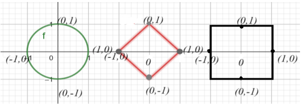

# 数值优化 (Numerical Methods for Optimization)

## 第1章 前置知识 (Prerequisites)

### 1.1 范数 (Norms)

#### 1.1.1 向量的范数 (Norms of vectors)

我们将从一些定义和结果开始，这些结果将在优化问题的求解中使用。

**定义 1** 设 $X$ 是一个向量空间。函数 $\|\cdot\|: X \to \mathbb{R}$ 被称为范数，当且仅当满足以下条件：

- 对于所有 $x \in X$，$\|x\| = 0 \iff x = 0$，
- 对于所有 $k \in \mathbb{R}, x \in X$，$\|kx\| = |k|\|x\|$，
- 对于所有 $x, y \in X$，$\|x + y\| \leq \|x\| + \|y\|$。

$(X, \|\cdot\|)$ 被称为一个范数空间。

以下性质可以作为练习来证明。

**命题 1** 设 $(X, \|\cdot\|)$ 是一个范数空间，则以下结论成立：

- 对于所有 $x \in X$，$\|x\| \geq 0$，
- 对于所有 $x \in X$，$\|x\| = \|-x\|$，
- 对于所有 $x, y \in X$，$\|x - y\| = \|y - x\|$，
- 对于所有 $x, y \in X$，$\|\|x\| - \|y\|\| \leq \|y \pm x\|$，
- 对于所有 $x_1, x_2, ..., x_n \in X$，$\|x_1 + x_2 + ... + x_n\| \leq \|x_1\| + \|x_2\| + ... + \|x_n\|$。

**备注** $\|\cdot\|$ 是一个连续函数。

范数的例子

1. 在 $X = \mathbb{R}^n$ 中，我们可以为 $x = (x_1, ..., x_n)$ 定义以下范数：

   (a) $\|x\|_1 = \sum_{i=1}^n |x_i|$,

   (b) $\|x\|_2 = \left( \sum_{i=1}^n |x_i|^2 \right)^{1/2}$,

   **提示** 要证明这是一个范数，请使用Minkowski不等式在 $\mathbb{R}^n$ 中，
   $ \left( \sum_{k=1}^n |x_k + y_k|^p \right)^{1/p} \leq \left( \sum_{k=1}^n |x_k|^p \right)^{1/p} + \left( \sum_{k=1}^n |y_k|^p \right)^{1/p}, p \geq 1$。

   (c) $\|x\|_\infty = \max_{i=1,2,...,n}\{|x_i|\}$。

2. 在 $X = B(A)$ 中，$A$ 上定义的有界函数空间中，我们定义
   $$
   \|f\|_\infty : B(A) \to \mathbb{R}
   $$
   $f \mapsto \sup\{|f(x)|, x \in A\}$。

3. 在 $X = C([a, b])$ 中，定义在区间 $[a, b]$ 上的连续函数空间中，我们可以定义
   $$
   \|f\|_\infty : C([a, b]) \to \mathbb{R}
   $$
   $f \mapsto \max\{|f(x)|, x \in [a, b]\}$，

   或者

   $$
   \|f\|_1 : C([a, b]) \to \mathbb{R}
   $$
   $f \mapsto \int_a^b |f(x)|dx$。

**练习** 在 $X = \mathbb{R}^2$ 中绘制 $\|x\|_p = 1$ 的图像，对于 $p = 1, 2, \infty$。

**证明** 对于 $p = 2$，我们有通常的欧几里得范数，因此 $\|x\|_2 = 1$ 表示单位圆。

对于 $p = 1$，可以观察到 $(1, 0)$, $(-1, 0)$, $(0, 1)$, $(0, -1)$ 的范数始终为1。然后方程为
$$
|x| + |y| = 1
$$
表示一条线。在第一象限，这条线是 $x + y = 1$，在第二象限是 $y - x = 1$，在第三象限是 $-x - y = 1$，在第四象限是 $x - y = 1$。所以 $\|x\|_1 = 1$ 是一个菱形。

同样，对于 $p = \infty$，点 $(1, 0)$，$(-1, 0)$，$(0, 1)$，$(0, -1)$ 始终有范数1。方程 $\|x\|_\infty = 1$ 表示其中一个坐标绝对值为1的点。这些点位于单位方形上。下图展示了这些曲线。

从 $p = 1$ 开始并逐渐增加其值到 $p = \infty$，我们观察到菱形膨胀成为 $p = 2$ 时的圆，并继续膨胀成为 $p = \infty$ 时的方形。稍后将解释在某些优化问题中使用 $\|\cdot\|_1$ 范数的优势。

**例子** 设 $S$ 是一个对称正定矩阵，属于 $M_n(\mathbb{R})$。对于 $x \in \mathbb{R}^n$ 是一个列向量，
$$
\|x\|_S = \sqrt{x^T S x}
$$
是 $\mathbb{R}^n$ 中的一个范数。

**练习** 证明 $\|x\|_S$ 是一个范数。绘制 $\|x\|_S = 1$，对于 $x \in \mathbb{R}^2$，并且 $S = I_2$，$S = \begin{bmatrix} 2 & 0 \\ 0 & 3 \end{bmatrix}$。

**评论解答** 为了验证它是一个范数，我们需要使用对称正定矩阵的一些性质，以下是这些性质：

- 因为 $S$ 是对称的，所以它的所有特征值都是实数，并且它的特征向量构成环境空间的一个正交基。
- 一个对称矩阵是可对角化的，它可以写作 $S = Q^T D Q$，其中 $Q$ 是一个正交矩阵，它的列是 $S$ 的特征向量，$D$ 是 $S$ 的特征值组成的对角矩阵。
- $S$ 是正定的，因此它的所有特征值都是正数。

- 对于每一个 $x \neq 0$，$x^T S x > 0$。
- $S$ 是对称正定的，所以它可以写成 $B^T B$ 的形式，其中 $B$ 的列是线性无关的。

现在我们准备证明 $\|\cdot\|_S$ 是一个范数。

- 如果 $x = 0$，则显然 $\|0\|_S = 0$。如果 $\|x\|_S = 0$，那么
  $$
  x^T S x = 0 \implies x^T Q^T D Q x = 0 \implies (Qx)^T D Q x = 0。
  $$
  由于 $D$ 的所有元素都是正的，并且 $D$ 是对角的，我们可以推导出 $Qx = 0$。由于 $Q$ 是可逆的，所以 $x = 0$。
  
- 通过简单的计算，我们可以推导出 $\|kx\|_S = k^2 \|x\|_S$ 对于任何 $k \in \mathbb{R}$ 成立，并且通过平方根，我们得出结果。
  
- 由以下观察，我们得出三角不等式：存在一个矩阵 $B$，其列是线性无关的，使得
  $$
  \|x\|_S^2 = x^T S x = x^T B^T B x = (Bx)^T (Bx) = \|Bx\|_2^2，
  $$
  这是欧几里得范数，因此满足三角不等式。因此
  $$
  \|x + y\|_S = \|B(x + y)\|_2 \leq \|Bx\|_2 + \|By\|_2 = \|x\|_S + \|y\|_S。
  $$
  注意，通过使用 $B$，其他性质也可以被证明。

当 $S = I_2$ 时，$\|x\|_S = \|x\|_2$，而当 $S = \begin{bmatrix} 2 & 0 \\ 0 & 3 \end{bmatrix}$ 时，它是一个加权范数，其单位球的形状是一个椭圆，其方程为
$$
2x^2 + 3y^2 = 1，
$$
因此 $a^2 = \frac{1}{2}$，$b^2 = \frac{1}{3}$。

#### 1.1.2 矩阵的范数 (Norm of a matrix)

在这一节中，我们将定义矩阵的范数，它将用于矩阵条件数的定义。

**定义 2** 考虑 $M_{n \times m}(\mathbb{R})$，这是一个 $n \times m$ 矩阵的向量空间。函数 $\|\cdot\|: M_{n \times m}(\mathbb{R}) \to \mathbb{R}$ 被称为范数，当且仅当它满足范数性质。在 $M_n(\mathbb{R})$ 空间上，矩阵范数还必须满足
$$
\|AB\| \leq \|A\|\|B\|。
$$
我们说这个范数是次乘性的。

**例子** 对于 $A \in M_{m \times n}(\mathbb{R})$，定义的范数为
$$
\|A\|_F = \sqrt{ \sum_{1 \leq i \leq m, 1 \leq j \leq n} |A_{i,j}|^2 }
$$
称为 Frobenius 范数。它衡量了矩阵的“大小”，因为具有小元素的矩阵会有较小的范数。证明当 $A$ 为方阵时，Frobenius 范数是次乘性的。

**提示** 使用 Cauchy-Schwartz 不等式
$$
\left( \sum_{i=1}^n x_i y_i \right)^2 \leq \sum_{i=1}^n x_i^2 \sum_{i=1}^n y_i^2。
$$

**从属范数（Subordinate norm）** 考虑赋予向量范数的 $X = \mathbb{R}^n, \|\cdot\|_X$ 和 $Y = \mathbb{R}^m, \|\cdot\|_Y$。设 $A$ 是一个 $n \times m$ 矩阵，并且 $x$ 是 $\mathbb{R}^n$ 的列向量。那么 $Ax$ 是 $\mathbb{R}^m$ 的列向量。我们想要衡量当 $A$ 将 $x \in \mathbb{R}^n$ 映射到 $y = Ax \in \mathbb{R}^m$ 时的最大膨胀。我们定义如下：
$$
\|A\| = \inf \{c : \|Ax\|_Y \leq c \|x\|_X, \forall x\}。
\tag{1.1}
$$

**备注**  

1. 注意到
   $$
   \|Ax\|_Y \leq \|A\| \|x\|_X
   $$
   所以 $\|A\| \in \inf \{c : \|Ax\|_Y \leq c \|x\|_X\}$。
2. 如果对于所有 $x \neq 0$，$\|Ax\|_Y \leq c \|x\|_X$，则
   $$
   \frac{1}{\|x\|_X} \|Ax\|_Y \leq c。
   $$
   因此
   $$
   \|A\left( \frac{x}{\|x\|_X} \right)\|_Y \leq c，
   $$
   该不等式仅当对所有 $\|x\|_X = 1$ 的 $w \in X$ 成立时，才成立。

   $\|Aw\|_Y \leq c$。

   如果 $\|w\|_X \leq 1$，那么
   $$
   \|Aw\|_Y \leq \frac{\|Aw\|_Y}{\|w\|_X} = \|A\left(\frac{w}{\|w\|_X}\right)\|_Y \leq c。
   $$
   该结果表明，作用在 $A$ 下的单位球的图像包含在可能具有不同半径的有界球中。如果 $c > 1$，则球可能会膨胀，但膨胀量不能大于 $c$。

**定义 3** 由 (1.1) 定义的 $\|A\|$ 被称为从属范数或 $M_{n \times m}(\mathbb{R})$ 空间上的诱导范数。

**命题 2** 设 $A \in M_{n \times m}(\mathbb{R})$。则
$$
\|A\| = \sup_{x \in X, x \neq 0} \frac{\|Ax\|_Y}{\|x\|_X} = \sup_{x \in X, \|x\| \leq 1} \|Ax\|_Y = \sup_{x \in X, \|x\| = 1} \|Ax\|。
$$

- 从属范数定义中的上确界是一个最大值。
- 从属范数是次乘性的。设 $A, B \in M_{n \times m}(\mathbb{R})$ 为方阵，则

$$
\|AB\| \leq \|A\| \|B\|。
$$

**证明**  

- 证明留作练习。
- 函数 $g : \mathbb{R}^n \to \mathbb{R}$，其中 $g(x) = \frac{\|Ax\|_Y}{\|x\|_X}$ 是连续的。单位球 ${x \in \mathbb{R}^n, \|x\| = 1}$ 是 $\mathbb{R}^n$ 中的紧集，因此 $g$ 取其边界的值。存在 $x_0$ 使得
  $$
  \|Ax_0\| = \|A\|。
  $$

因此
$$
\|ABx\|_X \leq \|A\| \|Bx\|_X \leq \|A\| \|B\| \|x\|_X。
$$
这意味着
$$
\|AB\| \leq \|A\| \|B\|。
$$

---

**命题 3** 由 (1.1) 定义的 $\|A\|$ 是 $M_{n \times m}(\mathbb{R})$ 中的范数。

**证明** 设 $A, B$ 是 $M_{n \times m}(\mathbb{R})$ 中的两个矩阵，则 $A + B \in M_{n \times m}(\mathbb{R})$。设 $x \in \mathbb{R}^n$ 是一个列向量。

$$
\|(A + B)x\|_Y = \|Ax\|_Y + \|Bx\|_Y \leq \|A\| \|x\|_X + \|B\| \|x\|_X \leq (\|A\| + \|B\|) \|x\|_X。
$$
因此
$$
\|A + B\| \leq \|A\| + \|B\|。
$$

$$
\|\lambda T\| = \sup_{x \neq 0, x \in X} \frac{\|\lambda Ax\|_Y}{\|x\|_X} = \sup_{x \neq 0, x \in X} \frac{|\lambda|\|Ax\|_Y}{\|x\|_X} = |\lambda| \sup_{x \neq 0, x \in X} \frac{\|Ax\|_Y}{\|x\|_X} = |\lambda| \|A\|。
$$

如果 $A$ 是零矩阵，则 $\|A\| = 0$，因为
$$
\|Ax\|_Y = 0 \implies \|A\| = 0。
$$
因此
$$
\|A\| \geq 0。
$$

如果 $\|A\| = 0$，则对于所有 $x \in \mathbb{R}^n$，
$$
\|Ax\|_Y \leq 0 \implies \|Ax\|_Y = 0，
$$
因此 $Ax = 0$ 对所有 $x$ 都成立，这意味着 $A$ 是零矩阵。

**命题 4** 设 $A$ 为一个大小为 $n$ 的方阵。

- 如果 $\mathbb{R}^n$ 赋予了 $\|\cdot\|_\infty$ 范数，那么
  $$
  \|A\|_\infty = \max_{i=1,...,n} \sum_{j=1}^n |a_{i,j}|,
  $$
  在这种情况下，$\|\cdot\|$ 也表示为 $\|\cdot\|_\infty$。

- 如果 $\mathbb{R}^n$ 赋予了 $\|\cdot\|_1$ 范数，那么
  $$
  \|A\|_1 = \max_{j=1,...,n} \sum_{i=1}^n |a_{i,j}|,
  $$
  在这种情况下，$\|\cdot\|$ 也表示为 $\|\cdot\|_1$。

- 如果 $\mathbb{R}^n$ 赋予了 $\|\cdot\|_2$ 范数，那么
  $$
  \|A\| = \sqrt{\rho(A^T A)}
  $$
  其中 $\rho$ 表示谱半径。在这种情况下，$\|\cdot\|$ 也表示为 $\|\cdot\|_2$。

#### 1.1.3 条件数 (Condition number)

现在我们准备定义矩阵的条件数。假设我们想求解
$$
Ax = b
$$
其中 $A \in M_n(\mathbb{R})$ 是一个可逆矩阵，代表数据矩阵。误差可能由于对 $A$ 和 $b$ 的元素测量不准确，或由于存储时四舍五入这些测量值而发生。我们关心的是 $A$ 和 $b$ 中的误差如何影响解 $x$ 的准确性。条件数将给我们一个估计，用于判断近似解是否合理。设 $\delta_b \in \mathbb{R}^n$ 和 $\delta_A \in M(\mathbb{R})$ 是在 $b$ 和 $A$ 上出现的误差。我们想要评估 $\delta_x$，其中 $x + \delta_x$ 是以下方程的解
$$
(A + \delta_A)(x + \delta_x) = b + \delta_b。
$$
如果 $\delta_A$ 不是“很大”，则 $A + \delta_A$ 是可逆的，并且我们可以根据 $\delta_A$ 估计 $\delta_x$。

**定义 4** 设 $\mathbb{R}^n$ 赋予了一个范数 $\|\cdot\|$，并且 $M_n(\mathbb{R})$ 赋予了由 $\mathbb{R}^n$ 诱导的从属范数 $\|\cdot\|_{\text{sub}}$。我们称矩阵 $A$ 关于范数 $\|\cdot\|$ 的条件数为正实数
$$
\text{cond}(A) = \|A\|_{\text{sub}} \|A^{-1}\|_{\text{sub}}。
$$
**定理 1** （由诱导的欧几里得范数定义的条件数的特征）

设 $\mathbb{R}^n$ 赋予了 $\|\cdot\|_2$ 范数，并且 $M_n(\mathbb{R})$ 矩阵赋予了从属范数。若 $A \in M_n(\mathbb{R})$ 是可逆矩阵，则

- 如果 $A$ 是对称正定矩阵，则
  $$
  \text{cond}(A) = \frac{\lambda_1}{\lambda_n}
  $$
  其中 $\lambda_1$ 是 $A$ 的最大特征值，$\lambda_n$ 是最小特征值。

- 如果 $A$ 是可逆矩阵，则 $A^T A$ 是对称正定矩阵，且其最大和最小特征值分别为 $\sigma_1$ 和 $\sigma_n$。此时，条件数为
  $$
  \text{cond}(A) = \sqrt{\frac{\sigma_1}{\sigma_n}}。
  $$

**证明** 证明留作练习。

让我们将 $A$, $b$ 和 $x$ 的相对误差分别表示为
$$
\epsilon(A) = \frac{\|\delta A\|_{\text{sub}}}{\|A\|_{\text{sub}}}, \quad \epsilon(b) = \frac{\|\delta b\|}{\|b\|}, \quad \epsilon(x) = \frac{\|\delta x\|}{\|x\|}。
$$

---

**定理 2** 设 $A \in M_n(\mathbb{R})$ 为可逆矩阵，$b \in \mathbb{R}^n, b \neq 0$。$\mathbb{R}^n$ 赋予了范数 $\|\cdot\|$，$M_n(\mathbb{R})$ 赋予了从属范数。假设 $\|\delta A\|_{\text{sub}} \|A^{-1}\|_{\text{sub}} < 1$。则 $A + \delta A$ 是可逆矩阵，并且
$$
\epsilon(x) \leq \frac{\text{cond}(A)}{1 - \text{cond}(A) \epsilon(A)} (\epsilon(A) + \epsilon(b))。
$$

如果条件数不显著大于1，则矩阵条件良好，这意味着其逆矩阵可以准确计算。如果条件数非常大，则矩阵称为病态矩阵。

---

**练习**  

1. 如果 $A$ 是可逆矩阵，则对于任意从属范数 $\text{cond}(A) \geq 1$。
2. 如果 $A$ 是可逆矩阵且 $a \in \mathbb{R}^*$，则 $\text{cond}(aA) = \text{cond}(A)$。
3. 如果 $Q$ 是正交矩阵，则 $\text{cond}(Q) = 1$ 在 $\|\cdot\|_2$ 范数下成立。
4. 证明定理 2。

### 1.2 收敛速度 (Rates of convergence)

大多数数值优化问题的求解方法都在尝试使一个序列收敛到一个局部极值。通常，我们有一个迭代算法在尝试找到函数 $f$ 的极值，并且我们想要估计达到该极值需要的时间。比较算法的一种方法是使用它们的收敛速度。在实际操作中，收敛速度取决于我们对函数的了解。使用较少关于 $f$ 信息的算法收敛得较慢。

**定义 5** 设 $x_n$ 为收敛到 $x_0$ 的序列，范数为 $\|\cdot\|$，且 $x_n \in \mathbb{R}^n$，即 $\lim_{n \to +\infty}\|x_n - x_0\| = 0$。我们说收敛是线性的，或者是一级的，如果存在 $a \in (0, 1)$ 和 $k_0 \in \mathbb{N}$，使得对于所有 $k \geq k_0$，
$$
\|x_{k+1} - x_0\| \leq a \|x_k - x_0\|。
$$
线性收敛的速度是 $r$
$$
r = \limsup_k \frac{\|x_{k+1} - x_0\|}{\|x_k - x_0\|}，
$$
该值是满足上述不等式的 $a$ 的所有值的下确界。

如果
$$
\lim_{k \to +\infty} \frac{\|x_{k+1} - x_0\|}{\|x_k - x_0\|} = 0，
$$
我们称收敛是超线性的 (superlinear)。

如果存在 $a > 0$ 和 $k_0 \in \mathbb{N}$，使得对于所有 $k \geq k_0$
$$
\|x_{k+1} - x_0\| \leq a \|x_k - x_0\|^\beta，
$$
我们称收敛至少是 $\beta$ 阶的。

收敛阶定义为满足该不等式的 $\beta$ 的上界。对于 $\beta = 2, 3$，我们分别称为二次和三次收敛。

**备注** 注意以下内容，它是前一个命题的逆命题的一部分。

假设 $\|x_n - x_0\|$ 收敛到 0，且
$$
r = \lim_{k} \frac{\|x_{k+1} - x_0\|}{\|x_k - x_0\|}
$$
存在。

- 如果该极限存在，则收敛是线性的，对于 $r \in [0, 1)$。特别地，当 $r = 0$ 时，表示超线性收敛。
- 如果该极限不存在，但
  $$
  a = \limsup_k \frac{\|x_{k+1} - x_0\|}{\|x_k - x_0\|} < 1，
  $$
  则收敛是线性的，且收敛速度不超过 $a$。

- 如果
  $$
  m = \liminf_k \frac{\|x_{k+1} - x_0\|}{\|x_k - x_0\|} = 1,
  $$
  则收敛是次线性的 (sublinear)，在其他情况下，即
  $$
  \liminf_k \frac{\|x_{k+1} - x_0\|}{\|x_k - x_0\|} < 1 \leq \limsup_k \frac{\|x_{k+1} - x_0\|}{\|x_k - x_0\|}
  $$
  我们无法对收敛速度进行任何推断。

**例子**  

- 序列 $x_n = 1 + \left(\frac{1}{2}\right)^n$ 线性收敛到 $x_0 = 1$。
  $$
  \frac{|x_{k+1} - 1|}{|x_k - 1|} = \frac{1}{2}
  $$
- 序列 $x_n = 1 + \left(\frac{1}{n}\right)$ 超线性收敛到 $x_0 = 1$。
  $$
  \frac{|x_{k+1} - 1|}{|x_k - 1|} = \frac{1}{n+1} \left(\frac{1}{\left(1 + \frac{1}{n}\right)}\right) \to 0
  $$
- 序列 $x_n = 1 + \left(\frac{1}{n}\right)^{2n}$ 二次收敛到 $x_0 = 1$。
  $$
  \frac{|x_{k+1} - 1|}{|x_k - 1|^2} = \left(\frac{n}{n+1}\right)^{2n+1} \leq 1。
  $$

注意，如果存在 $a \in (0, 1)$ 和 $k_0 \in \mathbb{N}$ 使得对于所有 $k \geq k_0$
$$
\|x_{k+1} - x_0\| \leq a \|x_k - x_0\|，
$$
那么该序列收敛到 $x_0$，因为这意味着
$$
\|x_k - x_0\| \leq a^{k-k_0} \|x_{k_0} - x_0\|
$$
并趋向于 0。对于 $\beta$ 阶的收敛情况则不同，它不能保证收敛。

---

**命题 5** **收敛的实用标准与阶的估计**  

- 如果存在 $a \in (0, 1)$ 和 $k_0 \in \mathbb{N}$ 使得对于所有 $k \geq k_0$
  $$
  \|x_{k+1} - x_0\| \leq a \|x_k - x_0\|，
  $$
  则该序列收敛到 $x_0$，收敛是线性的，且收敛速度 $r \leq a$。
- 假设 $\beta > 1$。如果存在 $a > 0$，$k_0 \in \mathbb{N}$ 使得对于所有 $k \geq k_0$，
  $$
  \|x_{k+1} - x_0\| \leq a \|x_k - x_0\|^\beta，
  $$
  并且存在 $k_1 \geq k_0$ 使得 $a \|x_k - x_{k-1}\|^{\beta - 1} < 1$，则该序列收敛到 $x_0$，且收敛速度至少是 $\beta$ 阶。

**练习**  

1. 使用定义证明收敛速度不是线性的，
   $$
   x_n = \frac{1}{n}。
   $$
2. 使用定义证明收敛速度不是二次的，
   $$
   x_n = \frac{1}{n^n}。
   $$
   证明实际上 $x_n$ 超线性收敛到0，但不以任何大于1的阶收敛。
3. 证明以大于1阶收敛的序列必须是超线性收敛的。
4. 确定序列 $x_n = 0.7^n$ 和 $u_n = 0.72^n$ 的收敛性或发散性。
5. 检查下列序列是否收敛。如果收敛，找出收敛速度或收敛阶。
   - $x_0 = 1$ 且 $x_{n+1} = \frac{1}{2} \ln(\sqrt{x_n + 1})$，$n > 0$。
   - $x_n = \sum_{k=1}^n \frac{1}{k^2}$。
   - $x_1 = 2$，$x_{n+1} = \frac{1}{2}\left(x_n + \frac{1}{x_n}\right)$。
   - $x_0 > 0$ 且 $x_{n+1} = (2^{-n} + 3^{-n})x_n$。

### 1.3 优化的解析方法 (Analytical methods of optimization)

优化包含寻找一个函数或多个变量的极小值或极大值。这个函数被称为目标函数。在优化中，我们至少关心连续函数，也包括离散函数（例如商品价格或给定设备的数量）。当一个函数只有一个极大值或极小值时，它被称为单峰函数。如果它有多个极大值或极小值，它被称为多峰函数。

**定义 6** 设 $X$ 是向量空间的一个凸子集，$f : X \to \mathbb{R}$ 是一个函数。如果对于所有 $t \in [0, 1]$ 和 $x, y \in X$，
$$
f((1 - t)x + ty) \leq (1 - t)f(x) + t f(y)，
$$
则称 $f$ 是凸的。

$f$ 的负函数 $-f$ 是凹的，因此 $f$ 是凸的。

**例子** 如果 $S \in M_n(\mathbb{R})$ 且 $x \in \mathbb{R}^n$ 是一个对称正定矩阵，则
   $$
   f(x) = x^T S x - a^T x + b
   $$
   是（严格）凸的。

#### 1.3.1 单变量函数 (Functions of one variable)

设目标函数为
$$
f : I \to \mathbb{R}
$$
并寻找问题的解
$$
\inf_{x \in I} f(x)，
$$
即找到 $x$ 使得对于所有 $y \in I$，$f(x) \leq f(y)$。我们也可以寻找局部解，其中对于所有 $y$ 在 $I$ 中的 $x$ 附近的一个邻域中，$f(x) \leq f(y)$。

我们回顾以下结果：

- 如果 $I$ 是紧的，那么该问题至少有一个解。
- 如果 $x$ 是极小值点且 $f$ 在 $x$ 可微分，则 $f'(x) = 0$。如果 $f$ 是二阶可微分的，那么 $f''(x) > 0$。
- 如果 $f$ 是严格凸的，则任何局部极小值都是全局极小值。
- 可能的极值是 $f'(x) = 0$ 的解。这些点被称为驻点。边界点也是可能的极值。为了找到全局极值，我们比较驻点和边界点的 $f$ 值。

前面的结果不适用于不连续函数或具有不连续导数的函数，但在 $f$ 和 $f'$ 连续的子区间内仍然成立。

**练习**  

1. 找到 $f(x) = x^2 + \frac{4}{x}$ 在区间 $[-1, 2]$ 上的全局极值。
2. 判断下列命题的真假：
   1. 设 $C$ 是由图像 $f(x) = |x|, x \in [-1, 1]$ 下面的区域，则 $C$ 是凸的。
   2. $[-1, 1] \times [-1, 1] \setminus C$ 是凸的。
   3. 函数 $f(x) = x^2$ 在区间 $(-1, 0) \cup (1, 2)$ 上是凸的。
   4. 任何凸函数在其定义域内部是连续的。
   5. 如果 $f$ 不是连续可微的，则它不能是凸的。
   6. 如果 $f$ 和 $g$ 是凸的，那么 $f + g$ 也是凸的。

- 找到任何驻点，并绘制函数 $f(x) = \frac{x - 5}{x}, x \in \mathbb{R}^*$ 的图像。

#### 1.3.2 多变量函数 (Functions of several variables)

设 $f$ 是定义在 $\mathbb{R}^n$ 上的实函数。$f$ 的驻点是 $\nabla f(x) = 0$ 的解。

这个条件对于极值是必要的，但还不够。对于驻点 $x^*$ 是极小值，$x^*$ 处的 Hessian 矩阵必须是正定的。同样地，对于极大值，Hessian 矩阵必须是负定的。如果一个矩阵的所有特征值的实部都是正数，则这个矩阵是正定的。如果 $f$ 定义在有界区间上，则可能的极值点可能位于定义域的边界。

**练习** 找到以下函数在 $\mathbb{R}^2$ 中的极值点：

- $f(x, y) = \log(x^2 + y^2 + 1)$
- $f(x, y) = x^2 - y^2$
- $f(x, y) = (y - 3x^2)(y - x^2)$
- $f(x, y) = x^5 y + y^5 x + xy$
- $f(x, y) = x^2 - 2xy + y^2$
- $f(x, y) = x^2 + y^2 - x - y - 1$，在 $D = \{(x, y) | x^2 + y^2 \leq 1\}$ 中

#### 1.3.3 带约束的函数 (Function subject to constraints)

**拉格朗日乘数法 (Lagrange multipliers)** 在物理和经济问题中的一种常见优化情况是寻找带有 $m$ 个约束条件的目标函数的极小值：
$$
\min_{x \in \mathbb{R}^n} f(x)
$$
在满足 $m$ 个等式约束条件的前提下：
$$
g_i(x) = 0, \quad i = 1, ..., m。
$$
最大化问题等价于最小化 $-f$。解决此问题的一种方法是使用拉格朗日乘数法。定义如下函数：
$$
L(x, \lambda) = f(x) + \sum_{i=1}^m \lambda_i g_i(x)
$$
这被称为拉格朗日函数 (Lagrangian)。$L$ 是 $x$ 和 $m$ 个标量 $\lambda_i$ 的函数，$i = 1, ..., m$。找到 $L$ 在无约束域中的驻点，等价于求解带约束问题。注意 $\frac{\partial L}{\partial \lambda_i} = 0$ 恢复约束条件。

**定理 3** 设 $f : \mathbb{R}^n \to \mathbb{R}$ 是目标函数，$g : \mathbb{R}^n \to \mathbb{R}^m$ 是约束函数，它们都属于 $C^1(\mathbb{R}^n)$。设 $x^*$ 为以下优化问题的最优解：
$$
\min_x f(x) \\
\text{subject to } g(x) = 0。
$$
如果 $D(g), D(f)$ 代表 $f$ 和 $g$ 的偏导数矩阵，则存在唯一的拉格朗日乘数 $\lambda \in \mathbb{R}^m$ 使得
$$
D(f)|_{x^*} = \lambda^T D(g)|_{x^*}，
$$
其中 $\lambda$ 是一个列向量。

---

**推论 1** 设 $f, g : A \subseteq \mathbb{R}^n \to \mathbb{R}$ 是两个函数，$A$ 是 $\mathbb{R}^n$ 的开集，$f, g \in C^1(A)$。如果 $P_0$ 是在约束 $g(P) = k, k \in \mathbb{R}$ 下的 $f$ 的局部极值点，并且 $\nabla g(P_0) \neq 0$，则存在 $\lambda \neq 0$ 使得
$$
\nabla f(P_0) = \lambda \nabla g(P_0)。
$$

**证明** 这里是证明的描述。设 $g(x_1, ..., x_n)$ 为 $C^1(A)$ 中的等高曲线，曲线水平为 $k \in \mathbb{R}$：
$$
g(x_1, ..., x_n) = k。
$$
由于 $\nabla g(P_0) \neq 0$，在点 $P_0$ 处的梯度将垂直于该等高曲线。因此，它垂直于通过点 $P_0$ 的任何曲线的切向量。设 $\sigma$ 定义为一个曲线
$$
\sigma : [a, b] \to \mathbb{R}^n \\
g(t) = (g_1(t), ..., g_n(t))
$$
对于某些 $t_0 \in [a, b]$，$\sigma(t_0) = P_0$。定义 $\phi : [a, b] \to \mathbb{R}$，$\phi = f \circ \sigma$。

通过链式法则，$\phi'(t) = \nabla f(P)\sigma'(t)$，并且由于我们在 $P_0$ 处有一个极值点，$\phi'(t_0) = 0$。这特别意味着
$$
\nabla f(P_0) \sigma'(t_0) = 0，
$$
因此，$\nabla f(P_0)$ 和 $\nabla g(P_0)$ 共线。

**备注**  

- 拉格朗日定理描述了可能的极值点。
- 可能的极值点也是 $\nabla g(P) = 0$ 的点。
- 如果约束条件描述了 $\mathbb{R}^n$ 中的一个闭的、有界的集合，则总存在最小值和最大值。在这种情况下，要确定它们，可以比较 $f$ 在所有可能的极值点的值。
- 如果约束集是无界的，那么在该集合上可能没有任何极值。判断驻点是否为局部极值的一种方法是使用 $f$ 的泰勒展开式在局部进行研究，并估计 $df = f(P) - f(P_0)$ 的符号。

**练习**  

1. 找到在以下约束条件下函数 $f$ 的极值点：
   - $f(x, y) = x - y + z$ 在约束 $x^2 + y^2 + z^2 = 2$ 下。
   - $f(x, y) = x^2 + y^2$ 在约束 $y = x - 1$ 下。
   - $f(x, y) = x - y$ 在约束 $x^2 - y^2 = 2$ 下。
   - $f(x, y, z) = x + y + z$ 在约束 $x^2 + y^2 = 2, x + z = 1$ 下。
   - $f(x, y, z) = x + y + z$ 在约束 $x^2 - y^2 = 1, 2x + z = 1$ 下。
   - $f(x, y) = x^2 + y^2 - x - y + 1$ 在约束 $S = \{(x, y) \in \mathbb{R}^2 | x^2 + y^2 \leq 1\}$ 上。
2. 在保持周长不变的情况下，求一个矩形的面积的最大值。
3. 对于 $p = 1, 2, \infty$，在约束 $Ax = b$ 下，求 $\min \|x\|_p$，其中 $A = \begin{bmatrix} 3 & 4 \end{bmatrix}$ 且 $b = [1]$。
   **备注** 在 $p = 1$ 范数下的最优解是稀疏解。
4. **（惩罚问题）** 考虑矩阵 $A = [\sigma]$，其中 $0 < \sigma \ll 1$ 非常小，$b \in \mathbb{R}$。求解问题：
   $$
   \min \|Ax - b\|_2^2。
   $$

   **提示** 当 $\sigma \ll 1$ 时，$A$ 的特征值非常小，这意味着 $A^{-1}$ 的特征值非常大。如果 $\sigma = 0$，$A$ 不可逆。在优化中，这种情况通常非常难处理，尤其是对于大矩阵。尝试求解问题并查看 $\sigma$ 的变化情况。现在添加一个惩罚项并求解问题：
   $$
   \min \|Ax - b\|_2^2 + \delta^2 \|x\|_2^2。
   $$

   让 $\delta > 0$ 趋近于 0。这个问题如何简化？

   **备注** 在统计学中，我们通常在 $\|\cdot\|_1$ 范数下使用惩罚项来求解问题：
   $$
   \min \|Ax - b\|_2^2 + \delta^2 \|x\|_1，
   $$
   因为它产生更真实、更稀疏的解。

## 第2章 数值方法 (Numerical methods)

解析方法代表了优化的一个重要理论基础，但通常情况下，优化是通过迭代数值方法来实现的，特别是在处理像工程中遇到的大规模问题时。

**定义 7** 设
$$
\min f(x) \\
g_i(x) = 0, \quad i = 1, ..., m
$$
为优化问题。我们称满足约束条件 $g_i$ 的 $f$ 定义域中的值集为可行集 (feasible set)。

对于多变量函数，主要有两类方法：直接搜索法 (direct search) 和梯度法 (gradient methods)。它们都基于相同的原理。

1. 在可行集上选择一个点，称为基准点，并计算该点的函数值。
2. 基于所使用的方法选择第二个点，并计算该点的目标函数值。
3. 比较两个点的值。如果第二个点的值更优，则它成为新的基准点。如果初始点的值更优，则修改搜索方向、策略或停止。
4. 继续，直到满足停止准则（或达到所需精度）。

### 2.1 直接搜索法 (Methods of direct search)

直接搜索是一种不需要梯度信息的优化问题求解方法，因此可以用于不可微甚至非连续的函数。直接搜索算法搜索一组围绕当前点的点，寻找目标函数值低于当前点的点，并将其作为新基准点，直到找到目标函数值较低的点，或者函数值不再降低。

#### 1. 单变量搜索 (One variable search)

假设我们想在 $\mathbb{R}^n$ 中最小化函数 $f$，且无约束。考虑 $\{e_1, e_2, ..., e_n\}$ 为 $\mathbb{R}^n$ 中的单位基向量，并从随机点 $x_0 = x_0^1 e_1 + ... + x_0^n e_n$ 开始。简单的单变量搜索方法将每次只修改一个变量。如果沿着方向 $v$ 移动，新点将是
$$
x_{n+1} = x_n + \alpha_n v_n，
$$
其中 $\alpha_n$ 需要适当地确定。对于第一个步骤，令 $v = e_1$，第二步时继续使用 $v = e_2$，依此类推。困难在于选择一个 $\alpha$，而关于它没有任何信息。另一种方法是沿着第一个方向移动到最小值，然后沿着第二个方向移动到最小值，依次类推，在必要时循环遍历所有方向，直到函数不再减少。

这种简单方法对于许多函数都能有效工作，但也有极其低效的例子。例如，如果你考虑一个函数，其水平集 (level sets) 形成狭长的山谷，并以某个角度与坐标系基线相交，如下图所示：

除非山谷是最佳方向的，否则沿着坐标向量下到山谷的唯一方法是进行微小的步长移动。因此，我们需要一组更好的方向。有许多方法可以定义这组方向，我们将解释 **Hooke-Jeeves** 算法，它易于理解和实现。

#### 2. Hooke 和 Jeeves 加速法 (Hooke and Jeeves acceleration method)

**Hooke-Jeeves加速法** 是一种比简单方向搜索收敛更快的方法，因为它在过程从一点移动到另一点时，跟踪移动的方向。

此方法将在二维空间中给出，但可以类似地推广到 $n$ 维。

1. **步骤 1** 从初始点 $x_0^1 = (x_0, y_0)$ 开始，并使用固定的变化量 $\pm \delta$ (例如 $\delta = 0.1$)，沿着 $Ox_1$ 移动。计算 $f$ 在 $(x_0 + \delta, y_0)$ 和 $(x_0 - \delta, y_0)$ 处的值，并比较它们。保留最佳值，并称为新点 $x_1^1$。

2. **步骤 2** 从新点开始，沿着 $Ox_2$ 方向移动，变化量为 $\pm \delta$。如果新点比 $x_1^1$ 有改善，则该点为 $x_1^2$。假设至少有一个值比初始点 $x_0^1$ 给出更好的结果。

3. **步骤 3** 在此处引入加速。定义由两点 $x_0^1$ 和 $x_1^2$ 形成的向量 $v$，并定义一个新点 $x_0^2$:
   $$
   x_0^2 = x_0^1 + \alpha v = x_0^1 + \alpha (x_1^2 - x_1^0)
   $$
   其中推荐的因子 $\alpha = 2$。在该方向上进行搜索，直到不再看到改进。

4. **步骤 4** 当你在向量 $v$ 方向上停止看到改进时，重复步骤1和2。当步骤1带你回到原始点时，进入步骤5。

5. **步骤 5** 减少增量间隔。如果你一开始增加和减少 $0.1$，现在可以增加和减少 $0.01$。然后重复一切，直到达到所需的精度。停止准则可以由用户决定，并可以设定为 $|\delta| < \epsilon, \epsilon > 0$ 以获得所需的精度。

由于搜索主要依赖于沿坐标方向的移动，算法可能会收敛到错误的解，尤其是在变量间有高度非线性交互的情况下。还需要注意的是，该算法仅通过在收敛点附近逐点搜索来终止。为了收敛到一个解，可能需要大量的函数评估以获得合理的精度。收敛到最优点依赖于参数 $\alpha$。

**练习**  

- 使用 Hooke-Jeeves 方法的一些步骤进行求解，初始近似为 $x = 0$ 和 $y = 0$，初始步长为 $h = 1$，以找到函数的最小值：
  $$
  f(x, y) = 3x^2 + 5y^2 + 4xy + 17x - 13y + 4。
  $$
- 使用 Hooke-Jeeves 方法的三步，并以 $x = 1, y = 1, z = 1$ 为初始近似，步长为 $h = 1$，求解函数的最小值：
  $$
  f(x, y, z) = 4\cos(0.3xy) + 3\cos(0.2yz) + 3\cos(0.1xz)。
  $$

**练习**  

1. 编写一个程序，该程序给定一个函数和一个初始点，以步长 0.1 在所有四个方向上测试函数。程序应打印出原始点、改进后的点以及两者之间的向量。使用函数 $f(x, y) = (x - 3)^2 + (y + 1)^2$ 来测试你的程序。
2. 编写一个程序，该程序给定一个函数、一个起点和一个向量，沿向量方向移动点，直到函数值不再减少。选择一个起点并通过你编写的代码运行，以找到一个向量。运行起点和向量，直到向量为 $(0, 0)$。
3. 编写一个程序，给定一个函数和一个起点，运行 Hooke-Jeeves 程序的前两步并返回下一个起点。重复，直到向量返回到 0。
4. 将第 3 步的代码插入到一个循环中，该循环将持续运行，直到向量为非零。使用函数
   $$
   f(x, y) = (x + y)^2 + \sin((x + 2)^2) + y^2 + 10
   $$
   以间隔 1 运行你的代码，得到一个新点；从该起点开始，用 0.1 的新间隔重复；继续重复，减小间隔，直到达到 0.0001 的间隔。

   - 将第 4 步的代码插入到一个循环中，该循环将以从 1 到 0.000001 的连续间隔运行 Hooke-Jeeves 算法。

#### 3. 单纯形法 (Simplex Method)

在几何中，单纯形是三角形或四面体到任意维度的概念的推广。

**定义 8** 给定集合 $E$ 的凸包 (convex hull) 是包含 $E$ 的唯一最小凸集，或者等价地，是包含 $E$ 的所有凸集的交集。

**定义 9** $k$-单纯形 ($k$-simplex) 是 $k$ 维多面体，等于其 $k + 1$ 个顶点的凸包。点 $u_0, u_1, ..., u_{k+1}$ 定义了 $k$ 个线性无关向量 $u_1 - u_0, u_2 - u_0, ..., u_n - u_0$，并且该单纯形由以下方式确定：
$$
\{ \lambda_0 u_0 + \lambda_1 u_1 + ... + \lambda_n u_n / \sum_{i=0}^{n} \lambda_i = 1 \text{ 且 } \lambda_i \geq 0 \}。
$$
单纯形是任何维度中最简单的多面体。因此：

- 在0维空间中，单纯形是一个点。
- 在1维空间中，单纯形是由两个点组成的线段。
- 在2维空间中，单纯形是由三个点组成的三角形。
- 在3维空间中，单纯形是由四个点组成的四面体（三角锥）。

对于单纯形法，我们将考虑规则的几何图形，例如在二维中使用等边三角形。然后按照以下步骤进行：

a) 选择一个初始基准图形，该图形有 $n + 1$ 个点 $x_{i,j}, j = 1, ..., n + 1$，这些点的坐标分别为 $x_{i,j}$，其中 $i = 1, ..., n$。

b) 计算顶点上的目标函数值，并确定得分最差的点（根据优化问题，取最小值或最大值）。该点称为 $x_R$，其坐标为 $x_{i,R}$。

c) 找到其他 $n$ 个点的质心 $x_C$
$$
   x_{i,C} = \frac{1}{n} \left( \sum_{j=1}^{n+1} x_{i,j} - x_{i,R} \right)
$$
   该点是算术平均位置。

d) 将 $x_R$ 拒绝，并用其关于质心对称的点 $x_N$ 代替。由于
$$
   \frac{x_N + x_R}{2} = x_C
$$
   则
$$
   x_{i,N} = \frac{2}{n} \left( \sum_{j=1}^{n+1} x_{i,j} - x_{i,R} \right) - x_{i,R}。
$$

e) 评估该新点处的函数值。

- 如果新点比被拒绝的点表现得更好，则该新点被采用，并确保远离错误的方向。重新开始于新点。如果新点比被拒绝的点表现得更差，则不接受该点。选择第二差的点作为被拒绝点，并像步骤 b 一样替换被拒绝点，使用其关于其他点的质心对称的点。

- 也可能出现新点不可行的情况。在这种情况下，无法接受它。第二差的点将再次被选为最差的点。

#### Nedler-Mead 单纯形法 (Nedler-Mead Simplex)

这种直接搜索方法在与单纯形法的比较中有许多特点，但其优点在于使用可变形的图形，这种多面体可以根据目标函数的形状进行调整。

这是在无约束问题中使用的最佳方法之一，适用于凸目标函数。注意，根据维度的不同，问题要么收敛，要么可能不收敛，甚至收敛到非驻点，存在可以通过其他方法解决的问题。此外，与高维问题相比，低维的优化问题收敛得更快。它对应于 Matlab 中的 `fminsearch` 方法，R 中的 `optim()` 函数，或 Python 中的 `minimize(method='Nelder-Mead')`。

从 $n$ 维空间中的一个初始点开始，Nelder-Mead 算法生成一系列顶点，逐渐逼近所需的最优点。在每次迭代中，单纯形的顶点根据目标函数的值进行排序，定义如下：
$$
f(x_1) \leq f(x_2) \leq ... \leq f(x_{n+1})
$$
其中 $x_1$ 是最优顶点，$x_{n+1}$ 是最差顶点。设 $f_i = f(x_i)$。

1. **步骤 1** 以其他点的质心为参考点，反射最差点。新点为
   $$
   x_r = x_C + \rho (x_C - x_{n+1}),
   $$
   其中 $\rho$ 是一个参数。

2. **步骤 2** 计算 $f_r = f(x_r)$，并根据以下情况进行操作。如果 $f_1 \leq f_r < f_n$，则用 $x_r$ 替换 $x_{n+1}$，并终止迭代。

3. **步骤 3** 如果上面的排序未满足，并且 $x_r$ 比当前最优点表现得更好，则沿该线指数扩展。如果新值比之前的值好很多，则收缩单纯形向更好的点收缩。
   - 如果 $f_r < f_1$，计算扩展点
     $$
     x_e = x_C + \chi (x_r - x_C),
     $$
     其中 $\chi$ 是一个参数。如果 $f_e = f(x_e) < f_r$，则用 $x_e$ 替换 $x_{n+1}$ 并终止迭代，否则用 $x_r$ 替换 $x_{n+1}$ 并终止迭代。

   - 如果 $f_r \geq f_n$，则进行参数为 $\gamma$ 的收缩操作。
     1. 如果 $f_n \leq f_{n+1}$，则进行外部收缩：
        $$
        x_{ec} = x_C + \gamma (x_r - x_C),
        $$
        其中 $f_{ec} = f(x_{ec})$。如果 $f_{ec} \leq f_r$，则用 $x_{ec}$ 替换 $x_{n+1}$ 并终止迭代。否则，进入收缩阶段。
     2. 如果 $f_r \geq f_{n+1}$，则进行内部收缩：
        $$
        x_{ic} = x_C - \gamma (x_C - x_{n+1})
        $$
        计算 $f_{ic} = f(x_{ic})$。如果 $f_{ic} < f_{n+1}$，则用 $x_{ic}$ 替换 $x_{n+1}$ 并终止迭代。否则，进入收缩阶段。

- **收缩** 使用参数 $0 < \sigma < 1$。
  对于 $2 \leq i \leq n + 1$，计算新点 $v_i$，$v_i = x_1 + \sigma (x_i - x_1)$。单纯形由无序点 $x_1, v_2, ..., v_{n+1}$ 组成。

  参数的推荐值为：$\chi > \rho$，$\rho = 1$，$\chi = 2$，以及 $0 < \gamma < 1$。

Nelder 和 Mead 使用当前单纯形中函数值的样本标准差。如果这些值下降到某个容忍度以下，则循环停止，并返回单纯形中最低点作为建议的最优解。

### 2.2 梯度法 (Gradient methods)

在本节中，我们将通过目标函数的梯度来求解优化问题。在最小化的情况下，算法将生成点序列 $x_0, x_1, ...$，其中
$$
x_{k+1} = x_k + t_k (\Delta x)_k，
$$
其中 $(\Delta x)_k$ 被称为搜索方向，$t_k$ 被称为步长。搜索方向是一个向量，指向目标函数值减少的方向，因此称为下降方向，这意味着
$$
f(x_{k+1}) < f(x_k)
$$
除非 $x_k$ 是最优的。

**定义 10** 设 $f : A \subseteq \mathbb{R}^n \to \mathbb{R}$ 是 $A$ 上开集的 $C^1(A)$ 函数。我们说 $v$ 是 $\mathbb{R}^n$ 中 $x$ 处的下降方向，如果函数 $h(t) = f(x + tv)$ 在 $t = 0$ 处的导数满足
$$
h'(0) < 0。
$$

一般算法在每次迭代中有三个步骤。固定一个初始点 $x_0 \in A$。

- 在当前点选择一个下降方向 $(\Delta x)_k$。
- 选择一个步长 $t_k$。
- 更新 $x_{k+1} = x_k + t_k (\Delta x)_k$。

直到满足停止准则。由于寻找 $C^1$ 函数的极小值从寻找驻点开始，因此当 $\nabla f(x) = 0$ 时，一个可能的停止准则是
$$
\|\nabla f(x)\| < \epsilon，\text{其中 } \epsilon > 0。
$$
第二步称为线搜索 (line search)，因为步长 $t_k$ 的选择决定了下一个迭代的位置 $x_k + t(\Delta x)_k/t \in \mathbb{R}^+$。

不同的算法在下降方向和步长的选择上有所不同。

由于梯度是函数的最大增加方向（或 $-\nabla f$ 是最大减少方向），因此在下降方向 $v$ 上，$\nabla f$ 和 $v$ 之间的角度必须是锐角，或者
$$
\nabla f^T \cdot v < 0。
$$

**备注** 如果 $f$ 是凸的并且二阶可微分，那么 Hessian 矩阵是正定的，从泰勒展开我们可以推导出，如果 $\nabla f(x_k)^T \cdot (\Delta x)_k > 0$，那么 $f(x_{k+1}) > f(x_k)$，这意味着如果我们希望 $f$ 减少，则必须沿下降方向移动。

对于这些算法，初始点的选择可能是至关重要的。如果函数是凸的，则没有问题，算法将收敛到唯一的最小值，并且所有的下降路径都会通向这一点。但如果函数不是凸的，则可能会有许多局部极小值。初始点的选择会影响收敛，并可能导致找到一个局部最小值，而不是全局最小值。由于我们只沿下降方向前进，因此最好尽可能地使用关于 $f$ 的所有信息来初始化，以尽可能接近真实的最小值。

#### 2.2.1 具有固定步长的梯度下降法 (Gradient descent with constant step size)

所有梯度下降算法都选择 $-\nabla f(x_k)$ 作为在 $x_k$ 处的搜索方向。我们解释的第一个算法使用固定步长 $a$，步骤如下：

1. 固定一个步长 $a$ 和初始点 $x_0 \in \mathbb{R}^n$。
2. 设 $x_{k+1} = x_k - a\nabla f(x_k)$。
3. 当 $\|\nabla f(x_k)\| < \epsilon$ 时停止迭代。

**定理 4** 设 $f : A \to \mathbb{R}$ 是 $C^2$ 函数且下界有界。固定点 $x_0 \in A$ 并假设

- 集合 $S = \{ x / f(x) \leq f(x_0) \}$ 在 $\mathbb{R}^n$ 中是闭的，
- 对于所有 $x \in S$，Hessian 矩阵满足 $lI_n \leq H(x) \leq LI_n$，其中 $0 < l \leq L$。

如果我们选择 $a < \frac{2}{L}$，则序列 $x_k$ 线性收敛到局部最小值，且收敛率不小于 $\tau = \max\{(1 - la), |1 - La|\}$。

这一结果意味着如果 Hessian 矩阵在局部最小值附近是正定的，那么算法将收敛到局部最小值，且收敛速度是线性的。在一般情况下，算法的收敛性（向局部最小值）取决于我们对 $f$ 的假设，收敛的速度取决于这些假设。

为了验证这些条件是否得到满足，我们需要确认集合 $S$ 是闭的。接下来的工作是帮助我们得出这一结论。

**定义 11** 设 $f : X \subseteq \mathbb{R}^n \to \mathbb{R}$。如果对于任意序列 $\{x_k\}$，当 $\lim_{k \to \infty} \|x_k\| = +\infty$ 时，有 $\lim_{k \to \infty} f(x_k) = +\infty$，则称 $f$ 在 $X$ 上是**强制性的 (coercive)**。

---

**命题 6**（强制性的特征）设 $f : \mathbb{R}^n \to \mathbb{R}$ 为一个连续函数。那么 $f$ 是强制性的，当且仅当对于任意 $a \in \mathbb{R}$，集合 $S = \{ x / f(x) \leq a \}$ 是紧的。

我们将证明这一结论对于一个特定函数成立。

$$
f(x) = \frac{1}{2} x^T S x - b^T x
$$

其中 $x, b \in \mathbb{R}^n$ 为列向量，$b$ 为常数，$S$ 为对称正定矩阵。

- 梯度为 $\nabla f(x) = Sx - b$ 且 Hessian 为 $S$。
- 迭代步骤为 $x_{k+1} = x_k - a(Sx_k - b)$。

这个函数是凸的（已证明），因此我们可以通过解析法找到其最小值，该最小值发生在 $S^{-1}b$ 处，最小值为
$$
f(S^{-1}b) = \frac{1}{2}(S^{-1}b)^T SS^{-1}b - b^T S^{-1}b = -\frac{1}{2} b^T S^{-1}b。
$$

$S$ 是对称的，因此 $S^{-1}$ 也是对称的，因此
$$
f(S^{-1}b) = \frac{1}{2} b^T S^{-1} SS^{-1}b - b^T S^{-1}b = -\frac{1}{2} b^T S^{-1}b。
$$

现在我们将确定算法收敛到这个最小值的速度。

---

**命题 7** 如果 $S$ 是一个 $n \times n$ 的对称矩阵，且 $\lambda_1, ..., \lambda_n$ 是其特征值。那么对于所有 $x \in \mathbb{R}^n$，我们有
$$
\| Sx \|_2 \leq \max\{ \lambda_i \} \|x\|_2。
$$

**证明** 选择一组正交基的特征向量 $e_1, ..., e_n$，并在此基中将 $x$ 表示为 $x = \sum_{i=1}^{n} x_i e_i$。

$$
\|Sx\|_2^2 = < Sx, Sx > = < \sum_{i=1}^{n} x_i Se_i, \sum_{i=1}^{n} x_i Se_i > = < \sum_{i=1}^{n} \lambda_i x_i e_i, \sum_{i=1}^{n} \lambda_i x_i e_i >。
$$

基是正交的，因此我们得到
$$
\|Sx\|_2^2 = \sum_{i=1}^{n} \lambda_i^2 x_i^2 \leq \max \lambda_i^2 \|x\|_2^2。
$$
**命题 8** 如果 $l, L$ 分别是 $S$ 的最小和最大特征值，且 $a \in (0, \frac{2}{L})$，则收敛是线性的，且收敛速率至多为 $\max\{|1 - al|, |1 - aL|\}$。当 $a = \frac{2}{l + L}$ 时，收敛速率最小，速率为 $r = \frac{L - l}{L + l}$。

**证明** 在以下表达式中，我们将迭代值替换为与前一个点的关系：
$$
x_{k+1} - x_k = x_k - a(Sx_k - b) - x_{k-1} + a(Sx_{k-1} - b) = (I_n - aS)(x_k - x_{k-1})。
$$
$S$ 的特征值为 $\lambda$，因此 $I_n - aS$ 的特征值为 $1 - a\lambda$，对于 $S$ 的特征值 $\lambda$，我们有
$$
\| x_{k+1} - x_k \|_2 \leq \max\{|1 - al|, |1 - aL|\} \| x_k - x_{k-1} \|_2。
$$
因此，当速率小于 1 时，我们有线性收敛，这保证了 $a \in (0, \frac{2}{L})$ 和 $a \in (0, \frac{2}{l})$。当 $|1 - al| = |1 - aL|$ 时，速率最小，因为否则我们可以通过改变 $a$ 的值来减少最大值。如果 $L > l$，唯一可能使这些值相等的情况是 $1 - al = aL - 1$，这给出了 $a = \frac{2}{l + L}$。因此收敛速率为
$$
1 - \frac{2l}{l + L} = \frac{L - l}{L + L}。
$$
如果 $l \ll L$，速率非常接近 1，此时矩阵的条件数较差，其条件数为 $\frac{L}{l}$。

---

#### 2.2.2 最优步长的梯度下降法 (Gradient descent with optimal step)

接下来的算法选择步长 $a_k$ 以最优的方式，即目标函数在给定方向上的下降尽可能大。

**定义 12** 我们称梯度下降法由以下方式给出：
$$
x_{k+1} = x_k - a_k \nabla f(x_k)
$$
如果步长 $a_k$ 是最优的，则 $a_k$ 使得实值函数 $h(t) = f(x_k - t \nabla f(x_k))$ 在 $\mathbb{R}^+$ 上最小化。

---

**命题 9** 如果 $a_k$ 是最优步长，那么 $-\nabla f(x_k)$ 和 $\nabla f(x_{k+1})$ 是正交的。

**证明** 对函数 $h(t)$ 求导得到 $h'(t) = -\nabla f(x_k - t \nabla f(x_k)) \cdot \nabla f(x_k)$。由于我们沿下降方向，$a_k > 0$。此外，$h'(0) < 0$，因此最小值发生在 $(0, +\infty)$，这意味着 $h'(a_k) = 0$。因此，
$$
< \nabla f(x_{k+1}), -\nabla f(x_k) > = 0。
$$
该结果适用于任何下降方向。

**方法的优点和缺点** 首先，变步长允许在应用方法时相较于固定步长有一定的灵活性。此外，当步长固定时，我们需要选择非常小的步长，这样算法可能会花费很长时间才能开始，特别是当我们离最小值较远时。一个不便之处在于我们需要搜索最优步长。具有固定步长的梯度下降是线性收敛的，而具有最优步长的梯度下降在性能上要优越得多，因为在 $\|\cdot\|_S$ 范数下（即 $\|\cdot\|_S = \sqrt{x^T S x}$，其中 $S$ 是对称正定矩阵）其收敛是线性的。

---

**命题 10** 对于函数 $f(x) = \frac{1}{2} x^T S x - b^T x$，其中 $b$ 是常向量，$S$ 是对称正定矩阵，且 $l, L$ 是其最小和最大特征值，方程 $Sx - b = 0$ 的唯一解 $x^*$ 满足
$$
\|x_{k+1} - x^*\|_S \leq \frac{L - l}{L + l} \|x_k - x^*\|_S。
$$
其中 $x_k$ 是带有最优步长的梯度下降迭代序列。此外，对于某个初始点 $x_0$，我们有上述不等式中的相等情况。

如果条件数 $\frac{L}{l}$ 接近 1，则收敛速度接近 0，我们没有收敛问题；但是当条件数非常大且 $l \ll L$ 时，矩阵的条件数很差。

---

​ 我们现在将确定最优步长 $a_k$ 的值，并讨论在一个条件良好的矩阵 $S$ 和二次函数
$$
f(x) = \frac{1}{2} x^T S x - b^T x + c
$$
的情况下的迭代。

注意，$\nabla f(x) = Sx - b$。设 $h(t) = f(x + tv)$，其中 $v$ 是 $x$ 处的最速下降方向。我们有 $h'(t) = v^T \nabla f(x + tv)$。在最优情况下，$h'(t) = 0$，因此
$$
v^T S (x + tv) - v^T b = 0 \quad \Longrightarrow \quad v^T Svt = v^T (b - Sx) \quad \Longrightarrow \quad t = \frac{v^T (b - Sx)}{v^T S v}。
$$

由于 $-\nabla f(x) = b - Sx$ 是最速下降方向 $v$，因此
$$
t = \frac{v^T v}{v^T S v} = \frac{\|v\|_2^2}{v^T S v}。
$$

此外，注意到 $v_{k+1} = b - Sx_{k+1} = b - S(x_k + a_k S v_k)$，则有
$$
v_{k+1} = v_k - a_k S v_k。
$$
总的来说，迭代过程如下：

$$
\begin{aligned}
x_{k+1} &= x_k + a_k v_k \\
v_k &= -\nabla f(x_k) \\
a_k &= \frac{\|v_k\|_2^2}{v_k^T S v_k} \\
v_1 &= b - Sx_1
\end{aligned}
$$

**练习** 考虑函数 $f(x) = \frac{1}{2} x^T S x$，$x \in \mathbb{R}^2$，$S = \begin{bmatrix} 1 & 0 \\ 0 & b \end{bmatrix}$。基于初始点 $(b, 1)$ 的值，算法会多快收敛到 $(0, 0)$？$b$ 与 $S$ 的条件数有何关系？画出 $f$ 的等高线，并画出由最速下降算法给出的某些迭代。

**提示** 如果条件数较大，迭代将遍布各处，而条件数较小的情况下，步长将非常小，收敛速度会极慢。

**备注** 当 $S$ 条件较差时，我们可以使用放松的梯度下降算法，该算法针对最优梯度下降进行调整，其迭代为
$$
x_{k+1} = x_k + a_k r_k
$$
唯一的变化是 $a_k = \beta_k a_{k0}$，其中
$$
a_{k0} = \frac{\|v_k\|_2^2}{v_k^T S v_k}
$$
且 $0 < \beta_k < 2$，其中 $\beta_k = 1$ 对应于最优梯度下降。已经证明，对于 $0 < \delta \leq 1$，$\delta \leq \beta_k \leq 2 - \delta$ 且
$$
L = 1 - \delta(2 - \delta)\frac{4L}{(l + L)^2}
$$
函数 $f$ 收敛到最小值 $x_0$ 的速度由下式支配：
$$
f(x_{k+1}) - f(x_0) \leq L^k(f(x_1) - f(x_0))，
$$
因此 $f(x_k)$ 以常数 $L$ 线性收敛到 $f(x_0)$，且 $x_k$ 线性收敛到 $x_0$。

#### 2.2.3 带有动量的梯度下降法 (Gradient descent with momentum)

梯度下降法用于最小化凸函数和非凸函数，但并不总是表现良好。在合理假设下，当函数是凸函数时，它可以确保找到最小值；但对于其他函数，它可能会卡在并非极值的驻点（如鞍点）或局部极小值处。有时，即使在凸函数收敛的情况下，收敛速度也可能非常慢，因此我们希望加速它。为此，我们使用动量 (momentum)，并通过一个简单的例子来解释其背后的动机。

- 考虑二次函数
  $$
  f(x) = \frac{1}{2} x^T S x
  $$
  其中 $S = \begin{bmatrix} \lambda_1 & 0 \\ 0 & \lambda_2 \end{bmatrix}$ 且 $x \in \mathbb{R}^2$，$\lambda_i > 0, \lambda_1 < \lambda_2$。注意，我们已经看到对于 $\lambda_1 = 1$ 和 $\lambda_2 = b$ 的特例，函数 $f$ 在 $(0, 0)$ 处有全局最小值，$\nabla f(x) = Sx$ 且 $\lambda_i$ 是 $S$ 的特征值。

如果我们用一个固定步长 $a$ 进行梯度下降，我们得到
$$
x_{k+1} = x_k - aSx_k
$$
因此
$$
(x_{1,k+1}, x_{2,k+1}) = (x_{1,k}, x_{2,k}) - a(\lambda_1 x_{1,k}, \lambda_2 x_{2,k}) = ((1 - a\lambda_1)x_{1,k}, (1 - a\lambda_2)x_{2,k})。
$$

由于我们希望迭代尽可能快地收敛到0，因此我们设
$$
|1 - a\lambda_1| \ll 1, |1 - a\lambda_2| \ll 1。
$$

如果 $\lambda_1$ 和 $\lambda_2$ 大致相同，那么收敛没有问题，可以设 $a \approx \frac{1}{\lambda_1}$；但如果 $\lambda_2$ 远大于 $\lambda_1$（这种情况下，条件数 $\frac{\lambda_2}{\lambda_1}$ 非常大且 $S$ 是病态的），则没有合适的 $a$。如果 $a \approx \frac{1}{\lambda_1}$，那么 $1 - a\lambda_2 \approx -1$，并且迭代的第二个分量会随着 $k$ 的增加发散到无穷大。如果 $a \approx \frac{1}{\lambda_2}$，则收敛速度非常慢，$1 - a\lambda_1 \approx 1$。

解决该问题的一种方法是引入一个记忆项（动量）来定义搜索方向，因为使用来自前几步的信息可以帮助我们改进近似。我们不再简单地取 $-\nabla f(x_k)$，而是取另一个向量 $z_k$，其主导项仍是梯度，但它通过一个记忆项进行了修正，具体如下：
$$
\begin{cases}
x_{k+1} = x_k - sz_k \\
z_k = \nabla f(x_k) + \beta z_{k-1}
\end{cases}
$$
其中 $s, \beta$ 为常数。使用这些常数，我们称该算法为“重球法 (heavy ball)”算法。我们可以将其想象为一个球沿着山谷滚动，而不是一个点，因此该算法能显著加速。使用动量代替梯度下降允许我们使用更大的步长。虽然较大步长可能会导致梯度下降发散（如在之前的例子中的第二个分量），但 $sz_k$ 可能保持有界，因此动量算法不会发散。

**定理 5** 设 $0 < l < L$ 为定值。设 $f$ 是可微的二次函数，并满足对于所有 $x, y \in \mathbb{R}^n$：
$$
\|\nabla f(x) - \nabla f(y)\| \leq L \|x - y\|。
$$

并且
$$
f(y) \geq f(x) + \nabla f(x) \cdot (y - x) + \frac{l}{2} \|y - x\|^2。
$$

对于带有动量和固定步长 $a = \frac{1}{L}$ 的梯度下降法，存在常数 $C = C_{l, L, x^*}$，使得对于任意 $k$，
$$
f(x_k) - f(x^*) \leq C k^2 \left( \frac{\sqrt{L} - \sqrt{l}}{\sqrt{L} + \sqrt{l}} \right)^{2k} \|x_0 - x^*\|^2。
$$

**例子** 考虑函数
$$
f(x) = \frac{1}{2} x^T S x，
$$
其中 $S \in M_2(\mathbb{R})$ 是对称正定矩阵，$x \in \mathbb{R}^2$。我们将应用带有动量的梯度下降法。

注意，当我们引入之前的步骤时，我们实际上得到的是一个三级方法。我们将把它写成同一阶的两个方程，但形式略有不同：
$$
\begin{cases}
x_{k+1} = x_k - s z_k \\
z_{k+1} = - \nabla f(x_{k+1}) = \beta z_k
\end{cases}
$$

或者使用 $f$ 的梯度表示为：
$$
\begin{cases}
x_{k+1} = x_k - s z_k \\
z_{k+1} = Sx_{k+1} = \beta z_k
\end{cases}
$$

我们知道，如果 $S$ 的某个特征值非常大，则梯度下降的收敛性得不到保证，正是该特征值导致了发散。$S$ 是对称正定矩阵，因此其特征向量构成了一组基，任何 $x$ 都可以在此基中表示。我们将沿着特征向量 $q$ 的方向前进，使得 $Sq = \lambda q$。假设 $c_k, d_k$ 是标量，使得 $x_k = c_k q$ 且 $z_k = d_k q$，该系统可重写为
$$
\begin{cases}
c_{k+1} = c_k - s d_k \\
d_{k+1} - c_{k+1}\lambda = \beta d_k
\end{cases}
$$

或者以矩阵形式表示为：
$$
\begin{bmatrix} c_{k+1} \\ d_{k+1} \end{bmatrix} = \begin{bmatrix} 1 & 0 \\ \lambda & 1 \end{bmatrix} \begin{bmatrix} 1 & -s \\ 0 & \beta \end{bmatrix} \begin{bmatrix} c_k \\ d_k \end{bmatrix}
$$

通过矩阵乘法得到：
$$
R = \begin{bmatrix} 1 & 0 \\ \lambda & 1 \end{bmatrix} \begin{bmatrix} 1 & -s \\ 0 & \beta \end{bmatrix} = \begin{bmatrix} 1 & -s \\ \lambda & \beta - \lambda s \end{bmatrix}。
$$

已知 $l \leq \lambda \leq L$ 且 $R$ 依赖于 $s, \beta$，我们的目标是最小化 $R$ 的特征值。$R$ 每一步都会乘以，因此如果其特征值很小，则收敛速度很快。已证明给出最优值的 $\beta, s$ 是：
$$
s_{\text{opt}} = \left( \frac{2}{\sqrt{l} + \sqrt{L}} \right)^2, \quad \beta_{\text{opt}} = \left( \frac{\sqrt{L} - \sqrt{l}}{\sqrt{L} + \sqrt{l}} \right)^2，
$$
其中 $R$ 的最大特征值为负值。该结果可以推广到 $S$ 为 $n$ 阶矩阵的情况，其中 $l, L$ 分别是其特征值的最小值和最大值。我们在此给出带有动量的衰减率为：
$$
\left( \frac{\sqrt{L} - \sqrt{l}}{\sqrt{L} + \sqrt{l}} \right)^2，
$$
其中 $l, L$ 分别是 $S$ 的最小和最大特征值。对于病态问题，动量法比梯度下降快得多。实际上，梯度下降的线性收敛速率为 $\frac{L - l}{L + l}$，如果 $\frac{l}{L}$ 很小（即 $1 - \frac{l}{L}$ 接近于1，收敛非常慢），那么 $\frac{\sqrt{l}}{\sqrt{L}}$ 大于 $\frac{l}{L}$ 并加快了收敛速度。

**备注** 应当明确指出，在一般情况下，$f(x_k)$ 的收敛性并不保证 $x_k$ 的收敛性，即使它收敛，也不保证它收敛到极小值。保证的是 $\|f(x_{k+1}) - f(x_k)\| \leq \epsilon$ 或 $\|\nabla f(x_k)\| \leq \epsilon$，因此算法将终止。一切都取决于我们做出的假设和我们所处理的集合。如果 $x_k$ 收敛，则在假设 $f$ 连续的前提下，$f(x_k)$ 也收敛。

#### 2.2.4 投影梯度法 (Projected gradient)

前面讨论的梯度下降法适用于无约束问题，其更新规则为：
$$
x_{k+1} = x_k - a_k \nabla f(x_k)。
$$

然而，对于约束优化，更新规则不一定会生成一个可行解。解决该问题的一个自然方法是将点 $x_{k+1} = x_k - a_k \nabla f(x_k)$ 投影到可行集 $C$ 上，$C$ 是一个闭且凸的集合。我们记欧几里得投影算子为 $proj_C()$，其定义为：
$$
proj_C(x_0) = \arg \min_{x \in C} \|x - x_0\|_2，
$$
这等价于
$$
\frac{1}{2} \arg \min_{x \in C} \|x - x_0\|_2^2，
$$
其中我们将该函数平方以使其可微分。

带有投影的梯度下降法的步骤如下：

- 选择初始点 $x_0 \in \mathbb{R}^n$。
- 选择步长 $a_k$。
- 迭代计算 $y_{k+1} = x_k - a_k \nabla f(x_k)$，
- 然后 $x_{k+1} = \text{proj}_C(y_{k+1}) = \frac{1}{2} \arg \min_{x \in C} \|x - y_{k+1}\|_2^2$。
- 继续迭代，直到满足某个条件为止。

找到 $\arg \min$ 也是一个优化问题，如果有封闭表达式，则易于解决且计算速度很快。如果 $C$ 不是凸集，或问题没有封闭形式，则可能需要较高的计算成本。关于投影，如果 $x_0 \in C$，则投影点就是 $x_0$ 本身；如果 $x_0 \notin C$，则投影点是使欧几里得距离最小的点。该点与 $x_0$ 到 $C$ 的距离垂直。在二维空间中，考虑以 $x_0$ 为圆心并逐渐增大的圆，直到圆与 $C$ 切点相交。在切点处有：
$$
\arg \min_{x \in C} \frac{1}{2} \|x - x_0\|_2^2 \in \partial C。
$$

**命题 11**（Bourbaki-Cheney-Goldstein 不等式 - 钝角判据）如果 $x \in C$ 且 $z \in \mathbb{R}^n$，则：
$$
(\text{proj}_C(z) - z)^T (\text{proj}_C(z) - x) \leq 0。
$$

**证明** 根据定义，$\text{proj}_C(z) = \frac{1}{2} \arg \min_{x \in C} \|x - z\|_2^2$ 对于 $z \in \mathbb{R}^n$。设 $f(x) = \frac{1}{2} \|x - z\|_2^2$，在 $\text{proj}_C(z)$ 处的梯度为 $\text{proj}_C(z) - z$。该不等式表明了投影的最优条件。实际上，
$$
0 \geq f(\text{proj}_C(z)) - f(x) = \nabla f(\text{proj}_C(z))^T (\text{proj}_C(z) - x)。
$$

**命题 12** 如果函数 $f$ 对于其定义域内的任意 $x, z$ 都满足
$$
\|f(x) - f(z)\| \leq L \|x - z\|，
$$
其中 $L \leq 1$，则称 $f$ 是非扩张的（non-expansive）。投影算子是非扩张的。如果 $Pz$ 是 $C$ 上点 $z$ 的投影，则有
$$
\|Pz - Px\|_2 \leq \|z - x\|_2。
$$

**证明** 由钝角不等式，我们有 $(Pz - z)^T (Pz - x) \leq 0$，对于 $x \in C$。将 $x$ 替换为 $Px$，得到 $(Pz - z)^T (Pz - Px) \leq 0$，并将 $z$ 替换为 $x$，$x$ 替换为 $Pz$，得到 $(Px - x)^T (Px - Pz) \leq 0$。等价地，我们有：
$$
<Pz - z, Pz - Px> \leq 0, \quad <x - Px, Pz - Px> \leq 0。
$$

将它们加在一起得到：
$$
<Pz - z + Px - x, Pz - Px> \leq 0。
$$

这可以重写为
$$
<x - z, Pz - Px> + <Pz - Px, Pz - Px> \leq 0。
$$

因此
$$
<z - x, Pz - Px> \geq \|Pz - Px\|_2^2，
$$
根据柯西-施瓦茨不等式：
$$
<z - x, Pz - Px> \leq \|z - x\|_2 \|Pz - Px\|_2，
$$
这些结合起来表明
$$
\|Pz - Px\|_2^2 \leq \|z - x\|_2 \|Pz - Px\|_2，
$$
进而得到结果
$$
\|Pz - Px\|_2 \leq \|z - x\|_2。
$$

我们声称，尽管没有证明，但投影的非扩张性和钝角不等式保证了算法的迭代是单调的，即
$$
f(x_{k+1}) \leq f(x_k)，
$$
这些用于找到投影梯度下降法的收敛率。以下是关于收敛性的一个结果。

**定理 6**（关于遍历收敛率）如果 $f$ 是凸的，则带有固定步长的投影梯度下降法满足：
$$
f\left( \frac{1}{K+1} \sum_{k=0}^{K} x_k \right) - f(x^*) \leq \frac{\|x_0 - x^*\|_2^2}{2a(K+1)} + \frac{a}{2(K+1)} \sum_{k=0}^{K} \|\nabla f(x_k)\|_2^2，
$$
其中 $x^*$ 是全局最小值，$a$ 是常数步长，$K$ 是迭代的总次数。

**解释** $\bar{x} = \frac{1}{K+1} \sum_{k=0}^{K} x_k$ 是经过 $K$ 次迭代后序列 $x_k$ 的平均值。定理表明：
$$
f(\bar{x}) - f(x^*) \leq \frac{\|x_0 - x^*\|_2^2}{2a(K+1)} + \text{正项}，
$$
并且 $f\left( \frac{1}{K+1} \sum_{k=0}^{K} x_k \right)$ 的收敛率类似于 $O\left(\frac{1}{K}\right)$。

如果项 $\sum_{k=0}^{K} \|\nabla f(x_k)\|_2^2$ 的正项不发散或以比 $K$ 小的速率求和，则该正项趋于 0。该收敛定理不同于之前看到的定理，因为它允许我们得出的结论是，点 $x_k$ 的质心收敛于 $x^*$，但并非每个点 $x_i$ 本身都收敛（这在序列收敛的情况下是可能的）。遍历收敛意味着 $x_0, x_1, ..., x_k$ 的平均值接近 $x^*$，但其中一些点可能从 $x^*$ 偏离，只要质心变得更接近 $x^*$。

#### 2.2.5 惩罚方法 (Penalty)

考虑约束最小化问题
$$
\min_{x \in C} f(x)，
$$
其中 $C$ 是 $\mathbb{R}^n$ 的闭凸子集。我们希望通过对不在 $C$ 中的点施加惩罚，将该问题转化为无约束优化问题。

**定义 13**. 令 $C \subset \mathbb{R}^n$ 为 $\mathbb{R}^n$ 的闭凸子集。我们称 $P : \mathbb{R}^n \to \mathbb{R}$ 为惩罚函数，当且仅当它满足以下条件：

- $P(x) \geq 0$，
- $P(x) = 0 \Leftrightarrow x \in C$。

**示例** (Beltrami 函数)：$C = \{x \in \mathbb{R}^n / g_i(x) \leq 0, h_j(x) = 0, i \in I, j \in J\}$ 时的惩罚函数为：
$$
P(x) = \sum_{i \in I} \max(0, g_i(x))^2 + \sum_{j \in J} (h_j(x))^2。
$$

为了应用惩罚法，我们移除约束，并将其放入目标函数中，使用标量 $\mu$：
$$
\min_{x \in \mathbb{R}^n} f(x) + \mu P(x)。
$$

我们有了一个新的无约束问题，其解在适当的假设下与约束问题的解一致。直观上可以看出，如果 $\mu$ 足够大，则新目标函数 $f(x) + \mu P(x)$ 会增加，因此其最小值会出现在 $C$ 内部（因为在 $C$ 外部，惩罚项 $P(x)$ 为正）。当然，最优的 $\mu$ 值是未知的，因此我们考虑一个递增的序列 $\mu_k > 0$，并令其趋于无穷。我们依次求解系统：
$$
\min_{x \in \mathbb{R}^n} f(x) + \mu_k P(x)，
$$
并记 $x_k$ 为其解。以下性质成立：

- 每次迭代目标函数增加。
- 每次迭代惩罚项减少。
- 每次迭代函数值本身增加。

如果 $x^*$ 是初始问题的最优解，则对于所有 $k = 1, 2, \dots$ 有：
$$
f(x_k) \leq f(x_k) + \mu_k P(x_k) \leq f(x^*)，
$$
并且在合理假设下，存在一个极限并求解约束问题。

**定理 7**. 设 $f$ 是 $C^1$ 函数，严格凸，且 $\lim_{\|x\| \to +\infty} f(x) = +\infty$，$C$ 是凸集，闭且非空。$P$ 是惩罚函数。对于所有 $k$，惩罚问题存在解 $x_k$，解的序列有极限 $\lim_{k \to \infty} x_k = x^*$，且该极限是 $C$ 上约束问题的唯一解。

### 2.3 线性规划 (Linear Programming)

当要最小化的函数是线性的，并且约束也是线性时，求解优化问题的适当方法是线性规划（Linear Programming, LP）。在最大化 $f$ 的情况下，我们可以最小化 $-f$，因此我们通常指的是最小化问题。

问题以以下形式给出。令 $f(x) = c^T x, x \in \mathbb{R}^n$：
$$
\min f(x) = \min \sum_{i=1}^{n} c_i x_i
$$
满足线性不等式约束
$$
g_i(x) \leq 0, \quad i = 1, ..., n\\
h_j(x) \geq 0, \quad j = 1, ..., m
$$
以及可能的一些线性等式约束
$$
u_k(x) = 0, \quad k = 1, ..., r
$$
并补充假设 $x_i \geq 0$ 对于所有 $i = 1, ..., n$。

上面的线性规划问题包含等式和不等式。第一步是将问题转化为一个等价的问题，该问题仅包含等式约束，并被称为标准形式 (canonical form)。

**定义 14** 如果线性规划问题写成有 $n + m$ 个变量和 $m$ 个方程的形式
$$
\min c^T x
$$
并且
$$
\begin{aligned}
a_{11}x_1 + ... + a_{1n}x_n \pm x_{n+1} - b_1 &= 0\\
a_{21}x_1 + ... + a_{2n}x_n \pm x_{n+2} - b_2 &= 0\\
&\vdots \\
a_{m1}x_1 + ... + a_{mn}x_n \pm x_{n+m} - b_m &= 0
\end{aligned}\\
x_i \geq 0, \quad i = 1, 2, ..., n+m
$$
其中 $b_i \geq 0$。

为将不等式转化为等式而添加（或减去）的变量称为松弛变量 (slack variables)。变量 $x_1, ..., x_n$ 是主要或结构变量 (main or structural variable)。满足标准形式等式的任何变量集合 $x_j, j = 1, ..., n+m$ 被称为解。当这些解是正数时，该解被称为可行解或实现解 (feasible or realizable)。

**示例** 将以下线性规划问题转换为标准形式：
$$
\min 2x_1 - x_2
$$
满足以下约束条件
$$
\begin{aligned}
3x_1 - 2x_2 &\geq -2\\
2x_1 - 4x_2 &\leq 3\\
x_1 + x_2 &\leq 6\\
x_1 &\geq 0\\
x_2 &\geq 0
\end{aligned}
$$

注意到 $b_1 = -2 < 0$，但常数项必须为正，因此第一步是将第一个不等式改为：
$$
\begin{aligned}
-3x_1 + 2x_2 &\leq 2\\
2x_1 - 4x_2 &\leq 3\\
x_1 + x_2 &\leq 6\\
x_1 &\geq 0\\
x_2 &\geq 0
\end{aligned}
$$
现在添加松弛变量 $x_3, x_4, x_5$ 以得到等式：
$$
\begin{aligned}
-3x_1 + 2x_2 + x_3 &= 2\\
2x_1 - 4x_2 + x_4 &= 3\\
x_1 + x_2 + x_5 &= 6\\
x_i &\geq 0
\end{aligned}
$$

有了 $m$ 个松弛变量，一个基由 $m$ 个变量组成，这些变量的系数在 $m$ 个方程中构成了一个方阵（非零行列式的方阵）。这些 $m$ 个变量称为基变量 (basic variables)。其他变量称为非基变量 (nonbasic variables)。如果基变量全为正或为零，则称为可行基解 (feasible basic solution)。当基变量严格为正时，它们是非退化解 (nondegenerate)。

可以通过将非基变量设为零来找到可行解，因此我们得到了 $m$ 个方程和 $m$ 个未知数，且它们构成的方阵非奇异，因此它们的值是唯一确定的。

例如在前面的例子中，我们立即看到 $x_3, x_4, x_5$ 是基变量，如果我们令 $x_1 = x_2 = 0$，则得到 $f(0, 0) = 0$，且 $x_3 = 2, x_4 = 3, x_5 = 6$。约束条件被满足，因此 $(0, 0, 2, 3, 6)$ 是一个可行解（但 $f$ 的值不一定是最小值）。

如果通过添加松弛变量和将非基变量设为 0，解的某些部分为负数（称为人工变量 (artificial variables)），则我们添加与负数变量相对应的新变量。这样，方程的数量不会改变，我们可以将那些为负数的变量转移到非基变量中（并设它们为 0），而我们将继续使用相同数量的基变量（由新变量组成的基）。

例如，考虑问题
$$
\min -4x_1 - 5x_2
$$
满足以下约束条件：
$$
\begin{aligned}
2x_1 + x_2 &\leq 6\\
x_1 + 2x_2 &\leq 5\\
x_1 + x_2 &\geq 6\\
x_1 + 4x_2 &\geq 2\\
x_1 &\geq 0\\
x_2 &\geq 0
\end{aligned}
$$

由于所有 $b_i > 0$，因此不需要改变不等式，只需添加松弛变量：
$$
\begin{aligned}
2x_1 + x_2 + x_3 - 6 &= 0\\
x_1 + 2x_2 + x_4 - 5 &= 0\\
x_1 + x_2 - x_5 - 6 &= 0\\
x_1 + 4x_2 - x_6 - 2 &= 0\\
x_i &\geq 0
\end{aligned}
$$

首先，必须找到一个可行解。第一次尝试是将非基变量 $x_1 = 0$ 和 $x_2 = 0$ 代入，并从 $x_3$ 到 $x_6$ 计算基变量。我们注意到所得解不能接受，因为两个变量 $x_5$ 和 $x_6$ 会取负值。第一次尝试失败后，我们使用人工变量法。

在两个给出负基变量的方程中，我们添加一个人工变量，人工变量必须为正或零：
$$
\begin{aligned}
x_1 + x_2 - x_5 + x_7 - 6 &= 0\\
x_1 + 4x_2 - x_6 + x_8 - 2 &= 0\\
x_i &\geq 0
\end{aligned}
$$

我们仍然将 $x_1$ 和 $x_2$ 作为非基变量，并加上 $x_5$ 和 $x_6$，这就引发了困难。所有非基变量都设为 0，即 $x_1 = x_2 = x_5 = x_6 = 0$。基变量的值为 $x_3 = 6, x_4 = 5, x_7 = 6, x_8 = 2$。

#### 2.3.1 单纯形法 (The Simplex Method)

当线性规划问题被写成如下形式时，可以用单纯形法求解：
$$
\min c^T x
$$
为满足约束条件 $Ax = b$ 和 $x_i \geq 0$，使用拉格朗日乘数法 (Lagrange multipliers)。在这种情况下，我们还有不等式约束 $x_i \geq 0$，因此使用的拉格朗日函数如下：
$$
L(x, \lambda, \mu) = c^T x + \lambda^T (Ax - b) - \mu^T x
$$
$\mu$ 称为 Karush–Kuhn–Tucker (KKT) 参数。求解驻点的问题变为：
$$
\begin{aligned}
\frac{\partial L}{\partial x_i} &= 0, \quad \text{for all } i \\
\frac{\partial L}{\partial \lambda_i} &= 0, \quad \text{for all } i \\
\mu_i &\geq 0 \\
x_i &\geq 0 \\
\mu_i x_i &= 0
\end{aligned}
$$

另一种解决方法是使用本节解释的单纯形法。

根据线性规划的一个基本定理，线性规划问题的可行基本解是可行解的凸多面体顶点。这个凸域称为单纯形。

如果这是可行集，则单纯形法的工作方式如下：从单纯形的任意角开始，评估目标函数的值。沿着目标函数值不断下降的边移动，直到到达下一个角。如果不存在这样的角，算法停止，$f$ 是无界的。否则继续，直到没有相邻的角具有更好的目标值。

**说明** 在加入松弛变量后，我们识别基变量和非基变量，并将所有内容（$f$ 和基变量）用非基变量表示。然后，基于 $f$ 的表达式，我们观察哪个变量在增加时能给出目标函数的更好值。那些不能改善 $f$ 的变量保持为非基变量（因为我们希望它们等于0）。在能够改善 $f$ 的变量中，选择改善最大的变量，并根据约束赋予其新的值（取可能的最小值，以确保不违反任何约束）。

**示例** 考虑一个已经处理过的例子，且已写成标准形式：
$$
\min 2x_1 - x_2
$$
在约束条件下：
$$
\begin{aligned}
-3x_1 + 2x_2 + x_3 &= 2 \\
2x_1 - 4x_2 + x_4 &= 3 \\
x_1 + x_2 + x_5 &= 6 \\
x_i &\geq 0
\end{aligned}
$$

首先找到一个可行解（在此例中为 $(0, 0)$，这是可行集的一个角点，其他任何角点只能有更大的 $x_1$ 和 $x_2$ 值）。如前所述，基变量为 $x_3, x_4, x_5$，因此可以用 $x_1, x_2$ 表示所有变量。由于 $f$ 已经用 $x_1, x_2$ 表示，所以只需重新写出约束条件：
$$
\begin{aligned}
x_3 &= 2 + 3x_1 - 2x_2 \\
x_4 &= 3 - 2x_1 + 4x_2 \\
x_5 &= 6 - x_1 - x_2 \\
x_i &\geq 0
\end{aligned}
$$

增加 $x_1$ 只会增加 $f$，因此将其保留为非基变量并设为0。相反，我们可以增加 $x_2$，但并非任意比例。所有变量都必须为正，因此：
$$
\begin{aligned}
2 - 2x_2 &\geq 0 \\
3 + 4x_2 &\geq 0 \\
6 - x_2 &\geq 0
\end{aligned}
$$

边界值为 $x_2 = 1, x_2 = -\frac{3}{4}, x_2 = 6$。我们保持 $x_2 = 1$，因此不违反任何约束条件。找到一个新解的估计值为：
$$
x_1 = 0, x_2 = 1, x_3 = 0, x_4 = 7, x_5 = 5
$$

新的非基变量为 $x_1$ 和 $x_3$，基变量为 $x_2, x_4, x_5$。此时，函数 $f = -1$。现在，将基变量表示为非基变量的函数：
$$
\begin{aligned}
x_2 &= 1 + 1.5x_1 - 0.5x_3 \\
x_4 &= 7 + 4x_1 - 2x_3 \\
x_5 &= 5 - 2.5x_1 + 0.5x_3
\end{aligned}
$$

且目标函数为：
$$
f = -1 + 0.5x_1 + 0.5x_3
$$

如果我们增加 $x_1$ 或 $x_3$，$f$ 会增加，因此没有任何变量可以改进 $f$，优化过程完成。

**练习** 用单纯形法 (simplex method) 求解以下问题：
$$
\max f = 2x_1 - x_2
$$
约束条件为：
$$
\begin{aligned}
-3x_1 + 2x_2 &\leq 2 \\
2x_1 - 4x_2 &\leq 3 \\
x_1 + x_2 &\leq 6 \\
x_i &\geq 0
\end{aligned}
$$

我们所做的操作对应于行之间的基本操作，即众所周知的高斯消去法。为了使算法自动化，我们将使用矩阵，与高斯方法一样，这就是为什么我们将方程排列在一个称为单纯形表格的矩阵中。

**单纯形表 (Simplex table)** 一旦系统变为标准形式后，就可以用矩阵表示求解阶段。创建一个包含该系统的矩阵，附加一列标记基变量（basis），并在最后一行填入 $f$ 的系数。
$$
\text{max } 2x_1 - x_2\\
~\\
\begin{array}{|c|c|c|c|c|c|c|}
\hline
\text{Basis} & x_1 & x_2 & x_3 & x_4 & x_5 & b \\
\hline
x_3 & -3 & 2 & 1 & 0 & 0 & 2 \\
x_4 & 2 & -4 & 0 & 1 & 0 & 3 \\
x_5 & 1 & 1 & 0 & 0 & 1 & 6 \\
f & 2 & -1 & 0 & 0 & 0 & 0 \\
\hline
\end{array}
$$
表 2.1: 单纯形表格第一次迭代。

1. 在第一步中，检查表格的最后一行，找到最大的正数（对于最大化问题）或最小的负数（对于最小化问题）。它对应于具有最佳贡献的变量，该变量将被移入基变量（每步将一个新变量移入基变量）。如果不存在这样的系数，则解是最优的。
2. 我们必须找到哪个变量将从当前基变量中移出。为此，将 $b$ 向量的每个元素除以所选向量对应元素的比率。在所有严格为正的比率中，选择最小的那个（在这个阶段，我们考虑到约束条件及其所带来的限制）。确实，当我们决定哪个变量成为基变量时，之前的非基变量将设为0。约束条件为给定的可接受值。  
在不违反约束条件的情况下，通过取最小的正数比率来确定新的基变量的值。相应的约束行使之前的基变量为零，因此这是成为非基变量并被替换的变量。在此步骤结束时，变更第一列的基变量。  
如果所有的比率均为负数，那么没有约束是限制性的。因此，没有什么可以阻止我们尽可能增加变量的值，这意味着该问题无界，停止问题。
3. 取出变量对应的行与列，并且交换基变量的列位置。下一步中，继续迭代计算。
4. 在下一次迭代中，应用高斯算法使得枢轴元素上下方的元素为零。一旦完成了这个操作，最后一行会给出新非基变量的$f$系数。重复第1步直到找到最优解（在最大化情况下，所有系数为负；在最小化情况下，所有系数为正）。

下一个单纯形表为：
$$
\begin{array}{|c|c|c|c|c|c|c|}
\hline
\text{Basis} & x_1 & x_2 & x_3 & x_4 & x_5 & b \\
\hline
x_3 & 0 & -4 & 1 & 1.5 & 0 & 6.5 \\
x_1 & 1 & -2 & 0 & 0.5 & 0 & 1.5 \\
x_5 & 0 & 3 & 0 & -0.5 & 1 & 4.5 \\
f & 0 & 3 & 0 & -1 & 0 & -3 \\
\hline
\end{array}
$$
表2.2：第二次迭代的单纯形表。

现在，最大的贡献对应于 $x_2$，最小的商与 $x_5$ 对应，$x_5$ 将离开基变量并被 $x_2$ 替代。枢轴元素为 3。我们应用高斯消去法，使得枢轴上下的元素为零。
$$
\begin{array}{|c|c|c|c|c|c|c|}
\hline
\text{Basis} & x_1 & x_2 & x_3 & x_4 & x_5 & b \\
\hline
x_3 & 0 & 0 & 1 & 0.833 & 1.333 & 12.5 \\
x_1 & 1 & 0 & 0 & 0.167 & 0.667 & 4.5 \\
x_2 & 0 & 1 & 0 & -0.167 & 0.333 & 1.5 \\
f & 0 & 0 & 0 & -0.5 & -1 & -7.5 \\
\hline
\end{array}
$$
表2.3：第三次迭代的单纯形表。

所有系数都为负，因此没有变量能够进一步改善$f$。我们完成了。解如下：
$$
f = -0.5x_4 - 1.5x_5 + 7.5
$$
且 $x_1 = 4.5, x_2 = 1.5, x_3 = 12.5, x_4 = x_5 = 0$，最大值 $\max f = 7.5$。

**备注**  

- 如果多个变量可能被选作枢轴规则，则选择进入基的变量是索引最小的（对于退出基的变量也是类似的）。
- 当一个或多个基变量等于零时，称一个基本解为退化解。退化并不是例外，而是规则。
- 可能发生的是，最优解不仅限于单个点，而是由一个完整的超平面组成，当要最小化的函数与该超平面平行时，称这种退化为第一类退化。

**练习**  

$$
\begin{array}{|c|c|c|c|}
\hline
         & P_1 & P_2 & P_3 \\
\hline
\text{parts } C_1 & 1 & 2 & 4 \\
\text{parts } C_2 & 2 & 1 & 2 \\
\text{parts } C_3 & 3 & 2 & 2 \\
\hline
\end{array}
$$
一家企业生产三种产品 $P_1, P_2, P_3$，使用三种材料 $C_1, C_2$ 和 $C_3$。公司每周最多可以使用70单位的 $C_1$，80单位的 $C_2$ 和60单位的 $C_3$。边际成本为每单位 $P_1$ 为3欧元，$P_2$ 为5欧元，$P_3$ 为6欧元。请使用单纯形法求解此问题并给出线性规划问题的标准形式。

**解答** 我们将数据转换为方程：
$$
\begin{aligned}
P_i &\geq 0 \\
P_1 + 2P_2 + 4P_3 &\leq 70 \\
2P_1 + P_2 + 2P_3 &\leq 80 \\
3P_1 + 2P_2 + 2P_3 &\leq 60
\end{aligned}
$$
总收益 $f = 3P_1 + 5P_2 + 6P_3$。标准形式为：
$$
\begin{aligned}
P_i &\geq 0 \\
P_1 + 2P_2 + 4P_3 + e_1 &= 70 \\
2P_1 + P_2 + 2P_3 + e_2 &= 80 \\
3P_1 + 2P_2 + 2P_3 + e_3 &= 60 \\
\max f &= 3P_1 + 5P_2 + 6P_3
\end{aligned}
$$

单纯形法产生以下表格：
$$
\begin{array}{|c|c|c|c|c|c|c|c|}
\hline
\text{Basis} & P_1 & P_2 & P_3 & e_1 & e_2 & e_3 & b \\
\hline
e_1 & 1 & 2 & 4 & 1 & 0 & 0 & 70 \\
e_2 & 2 & 1 & 2 & 0 & 1 & 0 & 80 \\
e_3 & 3 & 2 & 2 & 0 & 0 & 1 & 60 \\
f   & 3 & 5 & 6 & 0 & 0 & 0 & 0 \\
\hline
\end{array}
$$
表2.4：单纯形表首次迭代。

$$
\begin{array}{|c|c|c|c|c|c|c|c|}
\hline
\text{Basis} & P_1 & P_2 & P_3 & e_1 & e_2 & e_3 & b \\
\hline
P_3 & 0.25 & 0.5 & 1 & 0.25 & 0 & 0 & 17.5 \\
e_2 & 1.5 & 0 & 0 & -0.5 & 1 & 0 & 45 \\
e_3 & 2.5 & 1 & 0 & -0.5 & 0 & 1 & 25 \\
f & 1.5 & 2 & 0 & -1.5 & 0 & 0 & -105 \\
\hline
\end{array}
$$
表2.5：单纯形表第二次迭代。

$$
\begin{array}{|c|c|c|c|c|c|c|c|}
\hline
\text{Basis} & P_1 & P_2 & P_3 & e_1 & e_2 & e_3 & b \\
\hline
P_3 & -1 & 0 & 1 & 0.5 & 0 & -0.5 & 5 \\
e_2 & 1.5 & 0 & 0 & -0.5 & 1 & 0 & 45 \\
P_2 & 2.5 & 1 & 0 & -0.5 & 0 & 1 & 25 \\
f & -3.5 & 0 & 0 & -0.5 & 0 & -2 & -155 \\
\hline
\end{array}
$$
表2.6：单纯形表第三次迭代。

**答案** $f = -3.5P_1 - 0.5e_1 - 2e_3 + 155$，其中 $P_1 = 0, e_1 = e_3, P_2 = 25, P_3 = 5, e_2 = 45$，最大值为 $f = 155$。

**松弛变量与人工变量** 考虑以下问题：
$$
\max 4x_1 + 5x_2
$$
满足条件：

$$
\begin{aligned}
2x_1 + x_2 &\leq 6 \\
x_1 + 2x_2 &\leq 5 \\
x_1 + x_2 &\geq 1 \\
x_1 + 4x_2 &\geq 2 \\
x_i &\geq 0
\end{aligned}
$$

引入松弛变量，将其转换为标准形式：
$$
\begin{aligned}
2x_1 + x_2 + e_1 &= 6 \\
x_1 + 2x_2 + e_2 &= 5 \\
x_1 + x_2 - e_3 &= 1 \\
x_1 + 4x_2 - e_4 &= 2 \\
x_i \geq 0, \quad e_i \geq 0
\end{aligned}
$$

首先需要找到一个可行解。尝试将 $x_1 = x_2 = 0$ 代入非基变量，得到 $e_1 = 6, e_2 = 5, e_3 = -1, e_4 = -2$，其中两个解为负数，因此该解不在可行域内。我们需要找到一个可行解来初始化算法。对于两个给出负解的部分，我们将引入两个人工变量 $e_5, e_6$，并要求它们为正。这两个变量可以替换基变量 $e_3, e_4$。
$$
\begin{aligned}
2x_1 + x_2 + e_1 &= 6 \\
x_1 + 2x_2 + e_2 &= 5 \\
x_1 + x_2 - e_3 + e_5 &= 1 \\
x_1 + 4x_2 - e_4 + e_6 &= 2 \\
x_i \geq 0, e_i \geq 0
\end{aligned}
$$

此时，$e_5, e_6$ 作为基变量，$e_3, e_4$（原本导致问题的变量）成为非基变量，因此可以将它们设为 0：
$$
e_3 = e_4 = x_1 = x_2 = 0, e_1 = 6, e_2 = 5, e_5 = 1, e_6 = 2
$$

此解对于原问题来说并不可行，因为约束条件并未满足。

注意，我们可以通过求解以下问题来满足原问题的可行解：
$$
\min e_5 + e_6
$$

在相同约束条件下。如果最小值为 0（这意味着 $e_5 = e_6 = 0$），则该系统的解是原问题的可行解。否则，如果最小值大于零，人工变量不能为零，从而表明原问题无可行解。

我们将通过使用单纯形表求解新的问题，看看是否能找到可行解。
$$
\min f_2 = e_5 + e_6
$$
满足以下约束条件：
$$
\begin{aligned}
2x_1 + x_2 + e_1 &= 6 \\
x_1 + 2x_2 + e_2 &= 5 \\
x_1 + x_2 - e_3 + e_5 &= 1 \\
x_1 + 4x_2 - e_4 + e_6 &= 2 \\
x_i \geq 0, e_i \geq 0
\end{aligned}
$$

由于非基变量为 $x_1, x_2, e_3, e_4$，目标函数必须写成这些变量的函数形式：
$$
f_2 = (1 - x_1 - x_2 + e_3) + (2 - x_1 - 4x_2 + e_4) = 3 - 2x_1 - 5x_2 + e_3 + e_4\\
~\\
\begin{array}{|c|c|c|c|c|c|c|c|c|c|}
\hline
\text{Basis} & x_1 & x_2 & e_1 & e_2 & e_3 & e_4 & e_5 & e_6 & b \\
\hline
e_1 & 2 & 1 & 1 & 0 & 0 & 0 & 0 & 0 & 6 \\
e_2 & 1 & 2 & 0 & 1 & 0 & 0 & 0 & 0 & 5 \\
e_5 & 1 & 1 & 0 & 0 & -1 & 0 & 1 & 0 & 1 \\
e_6 & 1 & 4 & 0 & 0 & 0 & -1 & 0 & 1 & 2 \\
f_2 & -2 & -5 & 0 & 0 & 1 & 1 & 0 & 0 & -3 \\
\hline
\end{array}\\
~\\
\begin{array}{|c|c|c|c|c|c|c|c|c|c|}
\hline
\text{Basis} & x_1 & x_2 & e_1 & e_2 & e_3 & e_4 & e_5 & e_6 & b \\
\hline
e_1 & 1.75 & 0 & 1 & 0 & 0 & 0.25 & 0 & -0.25 & 5.5 \\
e_2 & 0.5 & 0 & 0 & 1 & 0 & 0.5 & 0 & -0.5 & 4 \\
e_5 & 0.75 & 0 & 0 & 0 & -1 & 0.25 & 1 & -0.25 & 0.5 \\
x_2 & 0.25 & 1 & 0 & 0 & 0 & -0.25 & 0 & 0.25 & 0.5 \\
f_2 & -0.75 & 0 & 0 & 1 & -0.25 & 1.25 & 0 & -0.5 & 0 \\
\hline
\end{array}\\
~\\
\begin{array}{|c|c|c|c|c|c|c|c|}
\hline
\text{Basis} & x_1 & x_2 & e_1 & e_2 & e_3 & e_4 & b \\
\hline
e_1 & 0 & 0 & 1 & 0 & 2.33 & -2.33 & 4.33 \\
e_2 & 0 & 1 & 0 & 1 & 0.67 & -0.67 & 3.67 \\
x_1 & 1 & 0 & 0 & -1.33 & 1.33 & -0.33 & 0.67 \\
x_2 & 0 & 1 & 0 & 0.33 & -0.33 & 0.33 & 0.33 \\
f_2 & 0 & 0 & 0 & 0 & 0 & 1 & 0 \\
\hline
\end{array}
$$
表2.7：单纯形表。

现在，针对主问题的解已经可用，第二个单纯形表是通过选取第一个单纯形表对应最后一次迭代的部分，并去掉人工变量的列构建的。现在，$f$的定义按照原始形式使用：
$$
\max 4x_1 + 5x_2
$$
约束条件如下：
$$
\begin{aligned}
2x_1 + x_2 + e_1 &= 6 \\
x_1 + 2x_2 + e_2 &= 5 \\
x_1 + x_2 - e_3 &= 1 \\
x_1 + 4x_2 - e_4 &= 2 \\
x_i \geq 0, \quad e_i \geq 0
\end{aligned}
$$

根据最后一个单纯形表，基本变量为$x_1, x_2, e_1, e_2$，因此$f$必须表示成非基变量的形式：
$$
f = 4 \left( 2/3 + 4/3 e_3 - 1/3 e_4 \right) + 5 \left( 1/3 - 1/3 e_3 + 1/3 e_4 \right) = 13/3 + 11/3 e_3 + 1/3 e_4\\
~\\
\begin{array}{|c|c|c|c|c|c|c|c|c|}
\hline
\text{Basis} & x_1 & x_2 & e_1 & e_2 & e_3 & e_4 & b \\
\hline
e_1 & 0 & 0 & 1 & 0 & 2.33 & -0.33 & 4.33 \\
e_2 & 0 & 0 & 0 & 1 & 0.67 & 0.33 & 3.67 \\
x_1 & 1 & 0 & 0 & 0 & -1.33 & 0.33 & 0.67 \\
x_2 & 0 & 1 & 0 & 0 & 0.33 & -0.33 & 0.33 \\
f & 0 & 0 & 0 & 0 & 3.67 & 0.33 & -4.33 \\
\hline
\end{array}\\
~\\
\begin{array}{|c|c|c|c|c|c|c|c|c|}
\hline
\text{Basis} & x_1 & x_2 & e_1 & e_2 & e_3 & e_4 & b \\
\hline
e_1 & 0 & -7 & 1 & 0 & 0 & 2 & 2 \\
e_2 & 0 & -2 & 0 & 1 & 0 & 1 & 3 \\
x_1 & 1 & 4 & 0 & 0 & 0 & -1 & 2 \\
x_3 & 0 & 3 & 0 & 0 & 1 & 1 & 1 \\
f & 0 & -11 & 0 & 0 & 0 & 4 & -8 \\
\hline
\end{array}\\
~\\
\begin{array}{|c|c|c|c|c|c|c|c|c|}
\hline
\text{Basis} & x_1 & x_2 & e_1 & e_2 & e_3 & e_4 & b \\
\hline
e_4 & -3.5 & 0.5 & 1 & 0 & 0 & 1 & 1 \\
e_2 & 0 & 1.5 & -0.5 & 1 & 0 & 0 & 2 \\
x_1 & 1 & 0.5 & 0 & 0 & 0 & 0 & 3 \\
x_3 & 0 & -0.5 & 0.5 & 0 & 1 & 0 & 2 \\
f & 0 & 3 & -2 & 0 & 0 & 0 & -12 \\
\hline
\end{array}\\
~\\
\begin{array}{|c|c|c|c|c|c|c|c|c|}
\hline
\text{Basis} & x_1 & x_2 & e_1 & e_2 & e_3 & e_4 & b \\
\hline
e_4 & 0 & 0 & -0.67 & 2.33 & 0 & 1 & 5.67 \\
x_2 & 0 & 1 & -0.33 & 0.67 & 0 & 0 & 1.33 \\
x_1 & 1 & 0 & 0.67 & -0.33 & 0 & 0 & 2.33 \\
x_3 & 0 & 0 & 0.33 & 0.33 & 1 & 0 & 2.67 \\
f & 0 & 0 & -1 & -2 & 0 & 0 & -16 \\
\hline
\end{array}
$$

所有$f$行的系数均为负数，因此$f$的最大值为16。我们有：
$$
f = -e_1 - 2e_2 + 16
$$
其中，$e_1 = e_2 = 0, x_1 = 2.33, x_2 = 1.33, e_3 = 2.67, e_4 = 5.67$。

#### 2.3.2 对偶问题 (Duality)

我们来设定优化问题 (称为原问题)：
$$
\max c^T x
$$
约束条件为：
$$
Ax \leq b, \quad x \geq 0
$$

其中，不等式是按行分开的。与原问题对应的对偶问题为：
$$
\min b^T w
$$
约束条件为：
$$
A^T w \geq c, \quad w \geq 0
$$

一种记住对偶转换的方法是对原问题的矩阵进行如下处理：
$$
\left[
\begin{array}{c|c}
A & b \\
c^T & 0
\end{array}
\right]
$$
对于对偶问题进行转置：
$$
\left[
\begin{array}{c|c}
A^T & c \\
b^T & 0
\end{array}
\right]
$$

**定理 8** 对偶的对偶是原问题。

**证明** 取对偶问题 $\min b^T w$，将其写为 $\max - b^T w$，约束条件为：
$$

- A^T w \leq - c, \quad w \geq 0

$$
现在取其对偶：
$$
\min - c^T x
$$
约束条件为：
$$

- A x \geq - b, \quad x \geq 0

$$
这等价于：
$$
\max c^T x
$$
在 $A x \leq b, \, x \geq 0$ 的约束下。

**定理 9** 如果原问题和对偶问题都有可行解，则两者都有有限的最优解，且目标函数的最优值相等。

**备注** 如果两个问题中有一个没有有限解，那么另一个也没有可行解。

为了更好地理解，最大化 $c^T x$ 时，我们需要找到最佳的上界，即所有上界中最小的那个。我们认为最好的上界是 $b^T w$ 的最小值。确实：
$$
Ax \leq b \implies w^T A x \leq w^T b, \, \text{因为} \, w \geq 0
$$

当 $A^T w \geq c$ 时：
$$
(A^T w)^T \geq c^T \quad \text{或者} \quad w^T A^T \geq c^T
$$
因此：
$$
c^T x \leq w^T A x \leq w^T b = (b^T w)^T
$$

这证明了 $b^T w$ 确实是上界，并选择此类上界中的最小值。

- 对原问题中的约束 $i$，对应于对偶问题中的变量 $w_i$，反之亦然。
- 当对偶变量为0时，相应的约束是饱和的，目标函数中与该变量对应的变量的边际成本（该变量的目标函数系数）等于对应对偶变量的绝对值。
- 如果对偶变量为0，原变量则不为0（一个约束未饱和）。

**例子** 一个园艺师希望至少种植504棵苹果树、256棵樱桃树和420棵梨树。供应商提供了两种可能的套餐：

A. 每个套餐包含4棵苹果树、5棵樱桃树和2棵梨树，单价为35欧元。
B. 每个套餐包含3棵苹果树、1棵樱桃树和5棵梨树，单价为34欧元。

计算需要的A和B的数量以使操作成本最小化。

**证明** 我们用 $x_1$ 表示购买的A套餐数量，用 $x_2$ 表示购买的B套餐数量。那么他将有 $4x_1 + 3x_2$ 棵苹果树，$5x_1 + x_2$ 棵樱桃树和 $2x_1 + 5x_2$ 棵梨树。需求量满足：
$$
\begin{aligned}
4x_1 + 3x_2 &\geq 504 \\
5x_1 + x_2 &\geq 256 \\
2x_1 + 5x_2 &\geq 420 \\
\min f = 35x_1 + 34x_2
\end{aligned}
$$

如果我们通过引入 $e_1, e_2, e_3 \geq 0$ 将问题转换为标准形式：
$$
\begin{aligned}
4x_1 + 3x_2 - e_1 &= 504 \\
5x_1 + x_2 - e_2 &= 256 \\
2x_1 + 5x_2 - e_3 &= 420 \\
\min f = 35x_1 + 34x_2
\end{aligned}
$$

最后，我们得到了负的 $e_i$, $i=1,2,3$，因此需要引入人工变量。在这种情况下，我们也可以通过对偶方案来处理。原问题将通过考虑 $y_1$ 是每棵苹果树的价格，$y_2$ 是每棵樱桃树的价格，$y_3$ 是每棵梨树的价格来转换。则：
$$
\begin{aligned}
4y_1 + 5y_2 + 2y_3 &\leq 35 \\
3y_1 + y_2 + 5y_3 &\leq 34 \\
\max f = 504y_1 + 256y_2 + 420y_3
\end{aligned}
$$

假设供应商设定了最大的可能价格（即在原问题中的35和34）。我们加入两个松弛变量 $u_1, u_2$，将问题转换为标准形式：
$$
\begin{aligned}
4y_1 + 5y_2 + 2y_3 + u_1 &= 35 \\
3y_1 + y_2 + 5y_3 + u_2 &= 34 \\
\max f = 504y_1 + 256y_2 + 420y_3
\end{aligned}
$$

- 原问题的每个方程 $i$ 对应于对偶问题的 $y_i$。例如，原问题的第一个方程涉及苹果树的数量，$y_1$ 则是苹果树的价格。
- 对偶目标函数中的系数 $504$ 是所需苹果的数量，它对应于第一步中的 $e_1$ 的绝对值。同样地解释其他系数。我们以相同方式解释最后一步（以及所有步骤）中的目标函数系数。

单纯形表为：
$$
\begin{array}{|c|c|c|c|c|c|c|}
\hline
\text{Basis} & y_1 & y_2 & y_3 & u_1 & u_2 & b \\
\hline
u_1 & 4 & 5 & 2 & 1 & 0 & 35 \\
u_2 & 3 & 1 & 5 & 0 & 1 & 35 \\
f & 504 & 256 & 420 & 0 & 0 & 0 \\
\hline
y_1 & 1 & 5/4 & 1/2 & 1/4 & 0 & 31/4 \\
u_2 & 0 & -11/4 & 7/2 & -3/4 & 1 & 31/4 \\
f & 0 & -374 & 168 & -126 & 0 & -4410 \\
\hline
y_1 & 1 & 23/14 & 0 & 5/14 & -1/7 & 107/14 \\
y_3 & 0 & -11/14 & 1 & -3/4 & 2/7 & 31/14 \\
f & 0 & -242 & 0 & -90 & -48 & -4782 \\
\hline
\end{array}
$$

因此，$f = -242y_2 - 90u_1 - 48u_3 + 4782$，并且 $y_2 = u_1 = u_3 = 0$，$max f = 4782$，$y_1 = 107/14$，$y_3 = 31/14$。但是目标是解原问题。变量的关联关系为：
$$
y_i \leftrightarrow e_i, \, i = 1, 2, 3, \, x_i \leftrightarrow u_i, \, i = 1, 2
$$

所以 $x_1 = 90$，$x_2 = 48$，$e_1 = 0$，$e_3 = e_2 = 242$。

注意，在对偶问题中问题可以表述为：一个供应商希望分别以 $y_1, y_2, y_3$ 的价格出售他的苹果、樱桃和梨树。他提供两个套餐A和B，单价分别为35欧元和34欧元。套餐A包含4棵苹果树、2棵樱桃树和2棵梨树，套餐B包含3棵苹果树、1棵樱桃树和5棵梨树。他希望出售504棵苹果树、256棵樱桃树和420棵梨树。价格 $y_i, i = 1, 2, 3$ 应该定多少才能最大化他的利润？
